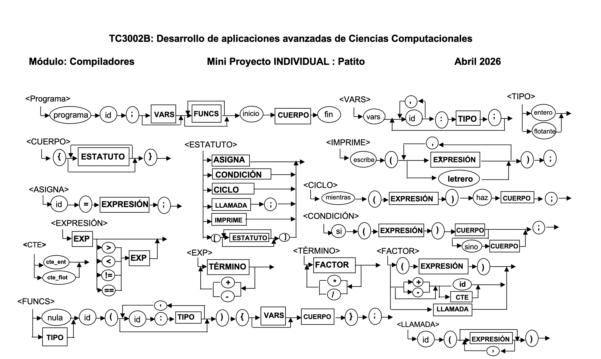

---

<!-- INICIO: README.md -->

# Documentación del Compilador Patito

Compilador del lenguaje **Patito** — *Víctor Misael Escalante Alvarado, A01741176*. Entrega 6 (versión final).

Esta carpeta contiene toda la documentación técnica del proyecto. Cada archivo está organizado por **tema** para que cualquier concepto se pueda consultar en un solo lugar.

> El repositorio acompañante se encuentra en
> <https://github.com/ElingeMisa/Desarrollo-Aplicaciones-Ciencias-Computacionales>.

## Índice

### Visión general

| Documento                                    | Contenido                                                                                                  |
|----------------------------------------------|------------------------------------------------------------------------------------------------------------|
| [`lenguaje.md`](lenguaje.md)                 | Descripción del lenguaje Patito: características, tipos soportados, estructuras de control y diagramas de sintaxis. |
| [`herramientas.md`](herramientas.md)         | Comparación de generadores automáticos de scanners/parsers (Flex+Bison, GPLEX+GPPG, ANTLR4) y justificación de la elección. |

### Análisis léxico y sintáctico (Entregas 0 y 1)

| Documento                            | Contenido                                                                                          |
|--------------------------------------|----------------------------------------------------------------------------------------------------|
| [`lexico.md`](lexico.md)             | Expresiones regulares de cada token, elementos base, tabla completa de tokens, comentarios y skip. |
| [`gramatica.md`](gramatica.md)       | Gramática BNF original, adaptaciones al pasar a `.g4` y lista final de reglas que ejecuta ANTLR4.   |

### Análisis semántico (Entrega 2)

| Documento                                                         | Contenido                                                                                                                                        |
|-------------------------------------------------------------------|--------------------------------------------------------------------------------------------------------------------------------------------------|
| [`cubo_semantico.md`](cubo_semantico.md)                          | Tabla de consideraciones semánticas: combinación tipo × operador × tipo → resultado.                                                             |
| [`estructuras.md`](estructuras.md)                                | Diseño de `VariableTable`, `Symbol`, `FunctionInfo` y `FunctionDirectory` (Entrega 2), de `PilaOperadores`, `PilaOperandos`, `PilaTipos`, `FilaCuadruplos` y `QuadrupleEmitter` (Entrega 3), y de `ExecutionMemory`, `ActivationRecord` y `VirtualMachine` (Entrega 5). |
| [`directorio_y_tablas.md`](directorio_y_tablas.md)                | Descripción de las estructuras que representan el Directorio de Funciones y las Tablas de Variables: campos, operaciones y ejemplo concreto de poblado a partir de código fuente. |
| [`puntos_neuralgicos.md`](puntos_neuralgicos.md)                  | Recorrido del árbol con ANTLR4: mapeo de cada `Enter…`/`Exit…` del listener a su acción semántica (PN-1 a PN-7, Entrega 2), a su acción de generación de cuádruplos (PN-8 a PN-18, Entregas 3 y 4), al Goto inicial que habilita la VM (PN-0, Entrega 5) y a la sentencia `regresa <expr>;` con sus direcciones de retorno (PN-19/PN-19a, Entrega 6). |

### Generación de código intermedio (Entregas 3 y 4)

| Documento | Contenido |
|-----------|-----------|
| [`cuadruplos.md`](cuadruplos.md) | Algoritmo completo de traducción a cuádruplos: formato `Quadruple`/`QuadOp`, algoritmos PN-8 a PN-18 con pseudocódigo y trazas de pilas, mecanismo de Backfill, ERA/EndFunc y el Goto inicial que separa funciones del `inicio{}`. |
| [`direcciones_virtuales.md`](direcciones_virtuales.md) | Distribución de Direcciones Virtuales: mapa de memoria con diez segmentos iniciando en 18 000, API de `VirtualMemoryMap`, `AddressBook`, pool de constantes y `ResetTemps`. |

### Máquina Virtual (Entrega 5)

| Documento | Contenido |
|-----------|-----------|
| [`memoria_ejecucion.md`](memoria_ejecucion.md) | Diseño de la Memoria de Ejecución: `ExecutionMemory`, `ActivationRecord`, `VirtualMachine`. Cómo las direcciones virtuales indexan la memoria. Diagrama del call stack. Soporte completo de `QuadOp`. |

### Calidad y verificación

| Documento | Contenido |
|-----------|-----------|
| [`pruebas.md`](pruebas.md) | Plan de pruebas consolidado: casos de scanner, parser, semántica, generación de código y test cases de la VM (TC-VM-01 a TC-VM-09, incluyendo `regresa` y el fix de aliasing en llamadas recursivas). |

## Mapa por entrega

Si lo que buscas es el material que corresponde a una **entrega específica**, esta es la equivalencia con los documentos por tema de arriba:

| Entrega                                    | Documentos relevantes                                                                                                                                              |
|--------------------------------------------|---------------------------------------------------------------------------------------------------------------------------------------------------------------------|
| **Entrega 0** — Definición del lenguaje    | [`lenguaje.md`](lenguaje.md), [`lexico.md`](lexico.md), [`gramatica.md`](gramatica.md) (sección "BNF original").                                                  |
| **Entrega 1** — Léxico y sintaxis          | [`herramientas.md`](herramientas.md), [`lexico.md`](lexico.md), [`gramatica.md`](gramatica.md) (secciones de ANTLR4), [`pruebas.md`](pruebas.md).                  |
| **Entrega 2** — Análisis semántico         | [`cubo_semantico.md`](cubo_semantico.md), [`estructuras.md`](estructuras.md) (§ Entrega 2), [`directorio_y_tablas.md`](directorio_y_tablas.md), [`puntos_neuralgicos.md`](puntos_neuralgicos.md) (§ Entregas 2), [`pruebas.md`](pruebas.md). |
| **Entrega 3** — Generación de cuádruplos  | [`cuadruplos.md`](cuadruplos.md), [`estructuras.md`](estructuras.md) (§ Entrega 3), [`puntos_neuralgicos.md`](puntos_neuralgicos.md) (§ Entrega 3), [`pruebas.md`](pruebas.md) (§ `CodeGenTests`). |
| **Entrega 4** — Funciones completas       | [`cuadruplos.md`](cuadruplos.md) (§ Entrega 4), [`puntos_neuralgicos.md`](puntos_neuralgicos.md) (§ Entrega 4), [`direcciones_virtuales.md`](direcciones_virtuales.md), [`pruebas.md`](pruebas.md). |
| **Entrega 5** — Direcciones virtuales + VM | [`direcciones_virtuales.md`](direcciones_virtuales.md) (implementación completa: `AddressBook`, pool de constantes, `ResetTemps`), [`memoria_ejecucion.md`](memoria_ejecucion.md) (VM: `ExecutionMemory`, `ActivationRecord`, `VirtualMachine`), [`puntos_neuralgicos.md`](puntos_neuralgicos.md) (§ PN-0), [`pruebas.md`](pruebas.md) (§ TC-VM). |
| **Entrega 6** — `regresa` y direcciones de retorno | [`puntos_neuralgicos.md`](puntos_neuralgicos.md) (§ PN-19/PN-19a), [`gramatica.md`](gramatica.md) (producción `retorno`), [`cuadruplos.md`](cuadruplos.md) (`QuadOp.Return`), [`memoria_ejecucion.md`](memoria_ejecucion.md) (ejecución de `Return` en la VM), [`direcciones_virtuales.md`](direcciones_virtuales.md) (dirección global `"{func}_ret"` y fix de aliasing), [`pruebas.md`](pruebas.md) (TC-VM-08/TC-VM-09). |

## Convenciones

- Los **no-terminales** de la gramática se escriben `<entre mayor y menor que>`.
- Los **terminales** van en minúsculas o `"entre comillas dobles"`.
- El símbolo `#` denota la **producción vacía** (epsilon).
- En notación regex (sección [`lexico.md`](lexico.md)) usamos `*`, `+`, `?`, `|`, `()` y `[a-z]` con el significado clásico.
- Los **identificadores de token** del lexer se escriben en `MAYUSCULAS` (p.ej. `KW_PROGRAMA`, `OP_EQ`) y siguen la convención de ANTLR4.
- Los **archivos de ejemplo** del lenguaje viven en [`../examples/`](../examples) y son la fuente de verdad para programas válidos e inválidos.

## Cómo se construyó esta documentación

La estructura **plana por tema** se eligió sobre una organización por entrega porque permite:

1. **Una única página por concepto.** Si en el futuro hay que actualizar un detalle de la gramática, se modifica un único documento ([`gramatica.md`](gramatica.md)) en lugar de buscar entre carpetas separadas.
2. **Trazabilidad por entrega preservada** vía el mapa de equivalencias de arriba.
3. **Compatibilidad con GitHub.** GitHub renderiza tablas, listas y enlaces relativos sin configuración adicional, lo que evita depender de un generador estático.

Cuando un documento incluye decisiones de diseño tomadas en una entrega específica, se anota expresamente (por ejemplo, "[Adaptación de Entrega 1]") para mantener la trazabilidad histórica.

<!-- FIN: README.md -->

---

<!-- INICIO: lenguaje.md -->

# El lenguaje Patito

Patito es un mini lenguaje diseñado para ilustrar el comportamiento de un compilador. Su gramática es deliberadamente pequeña para que cada fase del compilador (análisis léxico, sintáctico y semántico) pueda explicarse con un esfuerzo razonable, pero al mismo tiempo es lo suficientemente rica como para tocar los puntos clásicos: variables tipadas, expresiones aritméticas, control de flujo y funciones.

## Características del lenguaje

Las decisiones de diseño se tomaron originalmente en la **Entrega 0** y son las siguientes:

- **Variables enteras y flotantes con declaración explícita de tipo.** No hay inferencia ni promoción implícita en declaraciones.
- **Funciones de tipo `nula`** (sin valor de retorno). Las funciones que sí devuelven valor declaran su tipo de retorno (`entero` o `flotante`).
- **Estructuras de control:** condicional `si`/`sino` y ciclo `mientras`/`haz`. No hay `para`, `casos`, `interrumpe` ni `continua`.
- **Instrucción de impresión `escribe`** que acepta una mezcla de expresiones y cadenas literales (`letrero`).
- **Expresiones aritméticas** con las cuatro operaciones (`+`, `-`, `*`, `/`) y **comparaciones relacionales** (`<`, `>`, `==`, `!=`).
- **Sin operadores lógicos.** No existen `y`, `o`, `no`; la sintaxis no permite combinar comparaciones.
- **Sin cadenas como valor de primera clase.** El token `LETRERO` solo aparece como argumento de `escribe`; no se puede asignar a una variable.

## Estructura general de un programa

Todo programa Patito sigue la misma plantilla:

```
programa <id>;
vars
    <declaraciones globales opcionales>

<definiciones de funciones opcionales>

inicio {
    <estatutos>
} fin
```

El identificador después de `programa` da nombre al módulo y vive en el directorio de funciones (ver [`estructuras.md`](estructuras.md)). Las secciones `vars` y de funciones son opcionales: un programa mínimo válido es

```patito
programa hola;
inicio {
    escribe("hola mundo");
} fin
```

(este es exactamente el archivo [`examples/01_minimo.patito`](../examples/01_minimo.patito)).

## Diagrama de sintaxis

El diagrama original que sirve como referencia visual está en [`img/Reglas.png`](../img/Reglas.png). Cubre las siguientes producciones de un vistazo:

`<Programa>`, `<VARS>`, `<TIPO>`, `<FUNCS>`, `<CUERPO>`, `<ESTATUTO>`, `<ASIGNA>`, `<CONDICIÓN>`, `<CICLO>`, `<IMPRIME>`, `<LLAMADA>`, `<EXPRESIÓN>`, `<EXP>`, `<TÉRMINO>`, `<FACTOR>` y `<CTE>`.



La traducción literal de cada caja del diagrama a notación BNF está en [`gramatica.md`](gramatica.md). Cuando hubo discrepancias entre el diagrama y la BNF original, se optó por la versión del diagrama por ser más legible; estas decisiones se documentan caso por caso en la sección de adaptaciones de [`gramatica.md`](gramatica.md).

## Tipos del lenguaje

| Tipo declarable    | Palabra reservada | Notación regex     | Ejemplo de literal |
|--------------------|-------------------|--------------------|--------------------|
| Entero             | `entero`          | `digito+`          | `0`, `42`, `1039203` |
| Flotante           | `flotante`        | `digito+ "." digito+` | `3.14`, `0.0`, `100.0` |

Hay dos tipos **implícitos** (no declarables por el usuario) que aparecen durante el análisis semántico:

| Tipo implícito | Origen                                                                |
|----------------|------------------------------------------------------------------------|
| `Bool`         | Resultado de los operadores relacionales (`<`, `>`, `==`, `!=`).        |
| `Nula`         | Tipo de retorno de funciones que no devuelven valor (`nula`).           |

El [`cubo_semantico.md`](cubo_semantico.md) define qué combinaciones de tipos son compatibles bajo cada operador.

## Alcances (scopes)

Patito tiene **dos niveles de alcance**, sin anidamiento adicional:

1. **Alcance global** — las variables declaradas en la sección `vars` justo después de `programa <id>;`. Son visibles desde cualquier lugar del programa.
2. **Alcance de función** — los parámetros y las variables declaradas en la sección `vars` de la función. Son visibles únicamente dentro de la función.

No hay bloques léxicos adicionales (un `si` o un `mientras` no abren un nuevo alcance), por lo que el modelo de tablas del compilador es deliberadamente simple: una `VariableTable` global y una por función. La justificación está en [`estructuras.md`](estructuras.md).

## Resolución de identificadores

Cuando dentro de una función se referencia un identificador, el compilador primero lo busca en la `VariableTable` local de la función y, si no lo encuentra, en la tabla global. Cuando se está fuera de una función (el cuerpo principal entre `inicio` y `fin`), solo se consulta la tabla global. Este comportamiento permite **ensombrecer** (shadowing) una variable global con una local del mismo nombre, lo que está cubierto por la prueba `VariableLocalEnsombreceALaGlobal` en [`pruebas.md`](pruebas.md).

## Lo que Patito *no* hace

Para evitar expectativas equivocadas, lo siguiente está **explícitamente fuera del alcance** del lenguaje en su versión actual:

- No hay arreglos ni estructuras compuestas.
- No hay manejo de cadenas más allá de pasarlas a `escribe`.
- No hay E/S de archivos.
- No hay módulos ni `import`/`include`.
- No hay manejo de excepciones.
- No hay funciones anidadas (toda función se declara al nivel del programa).
- No hay punteros, referencias ni paso por referencia.
- No hay operadores compuestos (`+=`, `++`, etc.).

Cualquiera de estos puntos podría agregarse como extensión en una entrega futura, pero exigirían tocar las tres fases del compilador.

<!-- FIN: lenguaje.md -->

---

<!-- INICIO: herramientas.md -->

# Herramientas de generación automática

Antes de implementar el scanner y el parser de Patito se evaluaron las herramientas disponibles para generarlos automáticamente. Escribirlos a mano (en C# puro) habría duplicado el esfuerzo y dejado las reglas mezcladas con la lógica de error, por lo que se descartó esa vía desde el inicio.

Esta investigación corresponde a la **Tarea 2 / Entrega 1** del proyecto y dejó como conclusión la elección de **ANTLR 4**.

## Candidatos evaluados

Se compararon tres familias de generadores que cubren los casos de uso típicos en proyectos de compiladores:

1. **Flex + Bison** — el estándar histórico del mundo C/UNIX.
2. **GPLEX + GPPG** — la traducción de Flex/Bison al ecosistema .NET.
3. **ANTLR 4** — un generador moderno con runtime oficial multilenguaje.

La siguiente tabla resume el análisis bajo los criterios más relevantes para implementar el front-end en **C# / .NET**.

| Criterio                  | Flex & Bison                          | GPLEX & GPPG                         | ANTLR 4                                  |
|---------------------------|---------------------------------------|--------------------------------------|------------------------------------------|
| Lenguaje generado         | C / C++                               | C# (.NET nativo)                     | C#, Java, Python, JS, Go, …              |
| Algoritmo de parser       | LALR(1) (+ GLR opcional)              | LALR(1)                              | ALL(*) adaptativo                        |
| Recursión izquierda       | Soportada                             | Soportada                            | Soportada (transformada)                 |
| Formato de entrada        | `.l` + `.y` separados                 | `.lex` + `.y` separados              | `.g4` unificado (lexer + parser)         |
| Integración C#/MSBuild    | No directa (requiere wrapper)         | YaccLexTools NuGet                   | `Antlr4BuildTasks` NuGet (auto)          |
| Soporte Unicode           | Limitado a 8-bit                      | Completo (21-bit)                    | Completo (21-bit)                        |
| Documentación general     | Abundante pero antigua                | Limitada, repos discontinuos         | Extensa, libro oficial, wiki activo      |
| Documentación C#          | Prácticamente nula (es C/C++)         | Pequeña, MIT pero baja actividad     | Grande, runtime oficial mantenido        |
| Licencia                  | BSD modificada / GPL3+ con excepción  | MIT                                  | BSD-3-Clause                             |
| IDE / herramientas        | CLI, plugins de editor                | CLI, reporte HTML de conflictos      | CLI, ANTLRWorks, plugins VS Code/IntelliJ |

## Por qué se descartaron Flex+Bison y GPLEX+GPPG

**Flex y Bison** generan código C que requiere un puente P/Invoke para integrarse en .NET. Aunque la integración es técnicamente posible, agrega complejidad al pipeline de `dotnet build`, complica el debugging (los breakpoints atraviesan dos runtimes) y obliga a mantener archivos `.l` y `.y` separados que sincronizar. Para un compilador académico el costo de mantenimiento no compensa.

**GPLEX y GPPG** son la traducción directa de Flex/Bison al ecosistema .NET. Su API es limpia y la integración con MSBuild funciona vía el paquete `YaccLexTools`, pero la **comunidad y la documentación son muy desiguales**: muchos repos llevan años sin actividad, los ejemplos suelen apuntar a versiones antiguas del SDK y, ante un error de plantilla, hay poca documentación de referencia. Para un proyecto que se va a extender entrega por entrega, ese vacío de soporte es un riesgo.

## ANTLR 4 — la elección

Se selecciona **ANTLR 4** como generador del front-end de Patito. Las razones son las siguientes:

### 1. Integración limpia con .NET

El paquete NuGet `Antlr4BuildTasks` añade el archivo `.g4` al ciclo normal de `dotnet build`. Cada compilación regenera `PatitoLexer.cs`, `PatitoParser.cs` y `PatitoBaseListener.cs` automáticamente. **No hay paso manual de generación ni Java instalado** en la máquina del desarrollador; el paquete trae su propio binario.

En el `.csproj` la integración se reduce a:

```xml
<ItemGroup>
  <PackageReference Include="Antlr4.Runtime.Standard" Version="4.13.1" />
  <PackageReference Include="Antlr4BuildTasks"        Version="12.8.0" PrivateAssets="all" />
</ItemGroup>

<ItemGroup>
  <Antlr4 Include="Patito.g4">
    <Package>Patito.Compiler.Generated</Package>
    <Listener>true</Listener>
    <Visitor>false</Visitor>
  </Antlr4>
</ItemGroup>
```

### 2. Gramática unificada en un solo archivo `.g4`

`Patito.g4` contiene en el mismo archivo las reglas del **lexer** (mayúsculas) y del **parser** (minúsculas). Esto reduce el costo cognitivo frente a tener `.l` y `.y` separados y mantiene cerca las definiciones que conceptualmente lo están (por ejemplo, `OP_EQ` y la regla `rel_op` que lo usa).

### 3. Algoritmo ALL(*) y manejo de recursión izquierda

ALL(*) realiza *lookahead* adaptativo, lo que permite escribir gramáticas tal como se piensan, sin reescritura para evitar conflictos `shift/reduce` ni LL(*k*) fijo. Esto es especialmente útil al añadir el manejador de errores y la generación de código intermedio en entregas futuras: una nueva producción no obliga a reorganizar reglas existentes.

### 4. Documentación y herramientas

ANTLR4 cuenta con:

- El libro de Terence Parr (*"The Definitive ANTLR 4 Reference"*).
- Ejemplos oficiales en GitHub para cada *target*, incluido C#.
- Herramientas visuales como **ANTLR Lab** y la extensión de **VS Code** que muestran el *parse tree* en vivo durante el desarrollo.

GPLEX/GPPG no tienen un equivalente con el mismo nivel de soporte.

## Cómo se organiza el archivo `.g4`

El archivo [`../src/Patito.Compiler/Patito.g4`](../src/Patito.Compiler/Patito.g4) sigue una estructura recomendada por la guía oficial:

1. **Cabecera** — declara el nombre con `grammar Patito;`.
2. **Reglas del parser** (minúsculas) — empezando por la regla raíz `programa` y bajando hasta los terminales más simples (`simple_atom`, `cte`).
3. **Reglas del lexer** (MAYÚSCULAS) — en este orden:
   1. Palabras reservadas (antes que `ID`).
   2. Operadores y delimitadores, con los de dos caracteres antes que los de uno.
   3. Constantes, con `CTE_FLOT` antes de `CTE_ENT`.
   4. `ID` y `LETRERO`.
4. **Fragments y reglas `-> skip`** — `WS`, `COMMENT_LINE`, `COMMENT_BLOCK`.

El lexer aplica la regla **longest-match** y, ante empates, prefiere la primera regla declarada. Por eso las palabras reservadas se definen **antes** que la regla `ID` y las versiones de dos caracteres (`==`, `!=`) antes de las de uno (`=`).

## Cómo se invoca el front-end desde el código

En tiempo de ejecución, el flujo del compilador es:

```
PatitoFrontEnd.Compile(source)
  ├── 1. PatitoLexer        ← Scanner (genera tokens)
  ├── 2. PatitoParser       ← Parser (genera parse tree)
  └── 3. SemanticAnalyzer   ← Listener semántico + generación de cuádruplos (Entrega 2 y 3)
```

El archivo [`../src/Patito.Compiler/PatitoFrontEnd.cs`](../src/Patito.Compiler/PatitoFrontEnd.cs) encadena las tres fases y devuelve un `CompileResult` con los tokens, el árbol, la lista de errores léxicos, sintácticos y semánticos, una referencia al `SemanticAnalyzer` ya poblado y la fila de cuádruplos (ver [`estructuras.md`](estructuras.md) y [`puntos_neuralgicos.md`](puntos_neuralgicos.md)).

### Campos relevantes de `CompileResult` (Entrega 3)

| Campo | Tipo | Descripción |
|-------|------|-------------|
| `Semantic` | `SemanticAnalyzer?` | Analizador con tablas y cubo populados. `null` si el parser falló. |
| `Quads` | `IReadOnlyList<Quadruple>?` | Fila de cuádruplos generados. Acceso directo a `Semantic.Quads`. |
| `Success` | `bool` | `true` si no hay errores léxicos, sintácticos ni semánticos. |

### Flags del CLI (Entrega 3)

El driver de línea de comandos (`Program.cs`) acepta los siguientes flags:

| Flag | Descripción |
|------|-------------|
| `--tokens`  | Imprime la lista de tokens con número, línea, columna y texto. |
| `--tree`    | Imprime el parse tree en formato Lisp-like y las tablas de símbolos. |
| `--symbols` | Imprime la tabla global y el directorio de funciones. |
| `--quads`   | Imprime la fila de cuádruplos generados en formato tabular: `# Op Left Right Result`. |
| `--demo`    | Ejecuta un programa Patito embebido y muestra tokens + cuádruplos. |

Ejemplo de salida de `--quads`:

```
=== Fila de Cuádruplos ===
   #  Op        Left          Right         Result
------------------------------------------------------------
   0  =         10            _             x
   1  +         x             5             t0
   2  =         t0            _             y
   3  =         3.14          _             z
   4  >         x             y             t1
   5  GotoF     t1            _             8
   6  Print     _             _             "x es mayor"
   7  Goto      _             _             10
   8  Print     _             _             "y es mayor o igual"
   9  Print     _             _             y
  10  <         x             100           t2
  11  GotoF     t2            _             14
  12  +         x             1             t3
  13  =         t3            _             x
  14  Goto      _             _             10
```

## Conclusión

ANTLR4 ganó por una combinación de **integración limpia con .NET**, **un solo archivo de gramática**, **algoritmo de parsing flexible** y **documentación abundante**. Las alternativas no eran inviables, pero cada una implicaba un costo adicional (puente P/Invoke en el caso de Flex/Bison o soporte limitado en el de GPLEX/GPPG) que no se justificaba para un proyecto que se va a extender entrega por entrega.

<!-- FIN: herramientas.md -->

---

<!-- INICIO: lexico.md -->

# Análisis léxico

Este documento describe el **scanner** del lenguaje Patito: las expresiones regulares con las que se reconocen los tokens, la lista completa de tokens y las decisiones de implementación del lexer en ANTLR4.

La especificación regex original es de la **Entrega 0**; las decisiones de prioridad (longest-match, palabras reservadas antes que `ID`) y el manejo de comentarios se introdujeron en la **Entrega 1** al traducir las reglas a un archivo `.g4`.

## Notación

Las expresiones regulares se escriben con la siguiente convención:

| Notación   | Definición                          |
|------------|--------------------------------------|
| `[a-z]`    | Clase de caracteres (rango).         |
| `X*`       | Cero o más repeticiones de `X`.      |
| `X+`       | Una o más repeticiones de `X`.       |
| `X?`       | Cero o una ocurrencia de `X`.        |
| `X\|Y`      | Alternativa: `X` o `Y`.              |
| `(X)`      | Agrupación.                          |
| `"xyz"`    | Cadena literal (token exacto).        |

## Elementos base

Para no repetir clases de caracteres a lo largo de las reglas, se definen los siguientes **fragments** auxiliares. En ANTLR4 son fragmentos `fragment …` y no producen tokens por sí mismos.

| Elemento  | Definición       |
|-----------|-------------------|
| `letra`   | `[a-zA-Z]`        |
| `digito`  | `[0-9]`           |
| `alfanum` | `letra \| digito` |

> **[Adaptación de Entrega 1]** La Entrega 0 definía `letra` como `[a-z]` (solo minúsculas). En el archivo `.g4` final se amplió a `[a-zA-Z]` para soportar identificadores en *camelCase* y *PascalCase* (p. ej. `sumarHasta`, `MiVariable1`), lo cual es más coherente con el resto del ecosistema .NET. Esta decisión está cubierta por la prueba `Identificador_AceptaMayusculasYMinusculas` (ver [`pruebas.md`](pruebas.md)).

## Palabras reservadas

Cada palabra reservada representa una cadena de caracteres exacta y tiene **prioridad sobre la regla `ID`**. En ANTLR4 esta prioridad se obtiene declarando las palabras reservadas antes que `ID` dentro del `.g4`.

| Token         | Lexema      |
|---------------|-------------|
| `KW_PROGRAMA` | `programa`  |
| `KW_INICIO`   | `inicio`    |
| `KW_FIN`      | `fin`       |
| `KW_VARS`     | `vars`      |
| `KW_ENTERO`   | `entero`    |
| `KW_FLOTANTE` | `flotante`  |
| `KW_NULA`     | `nula`      |
| `KW_SI`       | `si`        |
| `KW_SINO`     | `sino`      |
| `KW_MIENTRAS` | `mientras`  |
| `KW_HAZ`      | `haz`       |
| `KW_ESCRIBE`  | `escribe`   |
| `KW_REGRESA`  | `regresa`   |

El requisito de *longest-match* asegura que identificadores como `siempre` se reconozcan como `ID` y **no** como `KW_SI` seguido de `empre`; las pruebas `Identificador_NoColisionaConKeywords` y `PalabraReservada_SeReconoceComoKeyword` blindan ambos lados.

## Identificadores

| Token | Produce               |
|-------|------------------------|
| `ID`  | `letra alfanum*`       |

Sirven para nombrar variables, parámetros, funciones y el programa mismo. Como `letra` y `alfanum` están definidos sobre `[a-zA-Z]` y `[0-9]`, los identificadores **no admiten `_` ni acentos**. Esto se preserva intencionadamente respecto a la Entrega 0.

## Constantes

### Constante entera

| Token     | Produce  |
|-----------|----------|
| `CTE_ENT` | `digito+` |

Ejemplos: `0`, `24`, `1039203`.

### Constante flotante

| Token      | Produce              |
|------------|----------------------|
| `CTE_FLOT` | `digito+ "." digito+` |

Ejemplos: `3.14159265`, `0.1`, `100.0`.

> **Decisión de orden.** En el `.g4`, la regla `CTE_FLOT` se declara **antes** que `CTE_ENT`. Si fuera al revés, ante una entrada como `3.14` el lexer podría producir tres tokens (`CTE_ENT`, `.`, `CTE_ENT`) en lugar de un único `CTE_FLOT`. La prueba `ConstanteFlotante_PrefiereCteFlotSobreEntero` valida que `3.14` produce un solo token.

## Cadenas literales (letrero)

| Token     | Produce              |
|-----------|----------------------|
| `LETRERO` | `'"' ~["\r\n]* '"'`  |

Una cadena empieza y termina con comillas dobles, no permite comillas dobles internas ni saltos de línea, y no soporta secuencias de escape. La regla original de la Entrega 0 prohibía únicamente `\n`; en la Entrega 1 se amplió para excluir también `\r`, ganando portabilidad entre Windows y Unix. El caso negativo está cubierto por `invalido_03_letrero_multilinea.patito`.

## Operadores

Estos operadores aparecen dentro de expresiones, asignaciones y condiciones. El orden de declaración importa: las versiones de dos caracteres (`==`, `!=`) deben aparecer **antes** que la versión de un carácter (`=`), de modo que el principio de *longest-match* devuelva el operador más largo posible.

| Token       | Uso                                | Lexema |
|-------------|------------------------------------|--------|
| `OP_ASIGNA` | Asignación de un valor              | `=`    |
| `OP_EQ`     | Igual a un valor                    | `==`   |
| `OP_NEQ`    | Diferente de                        | `!=`   |
| `OP_LT`     | Menor que                           | `<`    |
| `OP_GT`     | Mayor que                           | `>`    |
| `OP_MAS`    | Suma o valor positivo               | `+`    |
| `OP_MENOS`  | Resta o valor negativo              | `-`    |
| `OP_POR`    | Multiplicación                      | `*`    |
| `OP_DIV`    | División                            | `/`    |

La prueba `OpEq_TienePrioridadSobreOpAsigna` verifica que la entrada `==` se tokenice como un único `OP_EQ` y no como dos `OP_ASIGNA` seguidos.

## Delimitadores y puntuación

Se les asigna un identificador propio para evitar confusiones con cualquier otra regla que use los mismos caracteres.

| Token       | Lexema |
|-------------|--------|
| `SEMICOLON` | `;`    |
| `COMA`      | `,`    |
| `LPAREN`    | `(`    |
| `RPAREN`    | `)`    |
| `LBRACE`    | `{`    |
| `RBRACE`    | `}`    |
| `COLON`     | `:`    |

## Comentarios y espacios en blanco

> **[Adaptación de Entrega 1]** La Entrega 0 dejaba la regla de comentarios marcada como `TBD`. En la Entrega 1 se eligieron las dos formas más comunes de lenguajes tipo C y se descartan mediante la directiva `-> skip` de ANTLR4 para que sean invisibles al parser sin tratamiento adicional.

| Token           | Definición regex      | Comentario                           |
|-----------------|------------------------|--------------------------------------|
| `COMMENT_LINE`  | `'//' ~[\r\n]*`        | Hasta fin de línea; se descarta.     |
| `COMMENT_BLOCK` | `'/*' .*? '*/'`        | Bloque al estilo C; no anidado.      |
| `WS`            | `[ \t\r\n]+`           | Espacios, tabs y saltos; se descartan. |

Las pruebas `ComentarioDeLinea_SeIgnora`, `ComentarioDeBloque_SeIgnora` y `Whitespace_NoGeneraTokens` confirman que ninguno produce tokens.

## Listado completo de tokens

Esta es la tabla maestra que consume el parser. La columna **Categoría** ayuda a entender qué tipo de elemento es cada token al imprimir la lista de tokens con `patitoc archivo.patito --tokens`.

| Token         | Produce              | Categoría             |
|---------------|----------------------|-----------------------|
| `KW_PROGRAMA` | `"programa"`         | Palabra reservada     |
| `KW_INICIO`   | `"inicio"`           | Palabra reservada     |
| `KW_FIN`      | `"fin"`              | Palabra reservada     |
| `KW_VARS`     | `"vars"`             | Palabra reservada     |
| `KW_ENTERO`   | `"entero"`           | Palabra reservada     |
| `KW_FLOTANTE` | `"flotante"`         | Palabra reservada     |
| `KW_NULA`     | `"nula"`             | Palabra reservada     |
| `KW_SI`       | `"si"`               | Palabra reservada     |
| `KW_SINO`     | `"sino"`             | Palabra reservada     |
| `KW_MIENTRAS` | `"mientras"`         | Palabra reservada     |
| `KW_HAZ`      | `"haz"`              | Palabra reservada     |
| `KW_ESCRIBE`  | `"escribe"`          | Palabra reservada     |
| `KW_REGRESA`  | `"regresa"`          | Palabra reservada     |
| `ID`          | `letra alfanum*`     | Identificador         |
| `CTE_ENT`     | `digito+`            | Constante entera      |
| `CTE_FLOT`    | `digito+ "." digito+` | Constante flotante   |
| `LETRERO`     | `"…"`                | Cadena de texto       |
| `OP_ASIGNA`   | `=`                  | Operador asignación   |
| `OP_EQ`       | `==`                 | Operador relacional   |
| `OP_NEQ`      | `!=`                 | Operador relacional   |
| `OP_LT`       | `<`                  | Operador relacional   |
| `OP_GT`       | `>`                  | Operador relacional   |
| `OP_MAS`      | `+`                  | Operador aritmético   |
| `OP_MENOS`    | `-`                  | Operador aritmético   |
| `OP_POR`      | `*`                  | Operador aritmético   |
| `OP_DIV`      | `/`                  | Operador aritmético   |
| `SEMICOLON`   | `;`                  | Puntuación            |
| `COMA`        | `,`                  | Puntuación            |
| `LPAREN`      | `(`                  | Puntuación            |
| `RPAREN`      | `)`                  | Puntuación            |
| `LBRACE`      | `{`                  | Puntuación            |
| `RBRACE`      | `}`                  | Puntuación            |
| `COLON`       | `:`                  | Puntuación            |

> **Nota:** En las producciones de la gramática (ver [`gramatica.md`](gramatica.md)) algunos tokens aparecen escritos directamente entre comillas (`"si"`, `"+"`, …) en lugar de con su nombre simbólico, sobre todo para los lectores que vienen del BNF original.

## Reglas implementadas en ANTLR4

El archivo [`../src/Patito.Compiler/Patito.g4`](../src/Patito.Compiler/Patito.g4) materializa todo lo anterior. La sección de lexer del `.g4` se organiza así:

1. **Palabras reservadas** — declaradas antes que `ID` para que ganen la prioridad de la regla *first-match*.
2. **Operadores y delimitadores** — con `OP_EQ`/`OP_NEQ` antes de `OP_ASIGNA` (longest-match).
3. **Constantes** — `CTE_FLOT` antes de `CTE_ENT` (longest-match).
4. **Identificador `ID`** — al final, para que ninguna palabra reservada caiga aquí por accidente.
5. **`LETRERO`** — cadena literal sin escapes ni saltos de línea.
6. **Fragments y reglas `-> skip`** — `WS`, `COMMENT_LINE`, `COMMENT_BLOCK`.

Las pruebas que verifican cada una de estas decisiones están listadas en [`pruebas.md`](pruebas.md) en la sección "Pruebas para el SCANNER".

<!-- FIN: lexico.md -->

---

<!-- INICIO: gramatica.md -->

# Gramática

Este documento describe la **gramática libre de contexto** del lenguaje Patito en dos formatos complementarios:

1. **BNF original** — La especificación tal cual quedó en la Entrega 0, útil como referencia conceptual y para comparar contra los diagramas de sintaxis.
2. **Reglas ANTLR4 (`.g4`)** — La forma final con la que el parser efectivamente se genera, incluyendo las adaptaciones que se hicieron en la Entrega 1 al traducir la BNF.

Para la lista de tokens (terminales) que estas reglas referencian, ver [`lexico.md`](lexico.md).

## Notación BNF

- Los **no-terminales** se escriben `<entre mayor y menor que>`.
- Los **terminales** en minúsculas o `"entre comillas"`.
- El símbolo `#` denota la **producción vacía** (epsilon).

## BNF original (Entrega 0)

### Definición base del programa

| No-Terminal   | →    | Produce                                                            |
|---------------|------|--------------------------------------------------------------------|
| `<programa>`  | →    | `programa id ";" <vars> <funcs> "inicio" <cuerpo> "fin"`           |

### Declaración de variables

| No-Terminal       | →   | Produce                                              | Descripción              |
|-------------------|-----|------------------------------------------------------|--------------------------|
| `<vars>`          | →   | `vars : <listado_vars>`                              | Sección de variables     |
| `<vars>`          | →   | `#`                                                  | Sin variables            |
| `<listado_vars>`  | →   | `<lista_ids> : <tipo> ; <listado_vars>`              | Un grupo `id:tipo`       |
| `<listado_vars>`  | →   | `#`                                                  | Fin de declaraciones     |
| `<lista_ids>`     | →   | `id`                                                 | Una variable             |
| `<lista_ids>`     | →   | `id , <lista_ids>`                                   | Múltiples variables      |
| `<tipo>`          | →   | `KW_ENTERO`                                          | Tipo entero              |
| `<tipo>`          | →   | `KW_FLOTANTE`                                        | Tipo flotante            |

### Funciones

| No-Terminal     | →   | Produce                                                                       | Descripción            |
|-----------------|-----|-------------------------------------------------------------------------------|------------------------|
| `<funcs>`       | →   | `<typo_fun> id (<params>) <vars> {<cuerpo>} <funcs>`                          | Definición de función  |
| `<funcs>`       | →   | `#`                                                                            | Sin más funciones      |
| `<params>`      | →   | `id : <tipo> <params_cont>`                                                   | Al menos un parámetro  |
| `<params>`      | →   | `#`                                                                            | Sin parámetros         |
| `<params_cont>` | →   | `, id : <tipo> <params_cont>`                                                 | Más parámetros         |
| `<params_cont>` | →   | `#`                                                                            |                        |
| `<typo_fun>`    | →   | `KW_NULA`                                                                     | Puede ser tipo void    |
| `<typo_fun>`    | →   | `<tipo>`                                                                       | Puede devolver un tipo |

### Llamada a función

| No-Terminal     | →   | Produce                                | Descripción              |
|-----------------|-----|----------------------------------------|--------------------------|
| `<llamada>`     | →   | `id ( <args> ) ;`                      | Llamada con argumentos   |
| `<args>`        | →   | `<expresion> <args_cont>`              | Al menos un argumento    |
| `<args>`        | →   | `#`                                    | Sin argumentos           |
| `<args_cont>`   | →   | `, <expresion> <args_cont>`            | Más argumentos           |
| `<args_cont>`   | →   | `#`                                    | Fin de argumentos        |

### Cuerpo

| No-Terminal         | →   | Produce                                  | Descripción                          |
|---------------------|-----|------------------------------------------|--------------------------------------|
| `<cuerpo>`          | →   | `{ <list_estatutos> }`                   | Forzosamente entre llaves            |
| `<list_estatutos>`  | →   | `<estatuto> <list_estatutos>`            | Lista de estatutos                   |
| `<list_estatutos>`  | →   | `#`                                      | Lista vacía                          |

### Estatuto

| No-Terminal | →   | Produce              | Descripción              |
|-------------|-----|----------------------|--------------------------|
| `<estatuto>`| →   | `<asigna>`           | Asignación               |
| `<estatuto>`| →   | `<condicion>`        | Condicional              |
| `<estatuto>`| →   | `<ciclo>`            | Ciclo                    |
| `<estatuto>`| →   | `<imprime>`          | Impresión                |
| `<estatuto>`| →   | `<llamada> ;`        | Llamada a función        |
| `<estatuto>`| →   | `[<list_estatutos>]` | Genera lista de estatutos |

### Asignación, condición y ciclo

| No-Terminal     | →   | Produce                                                          | Descripción                  |
|-----------------|-----|------------------------------------------------------------------|------------------------------|
| `<asigna>`      | →   | `id OP_ASIGNA <expresion> ;`                                     | El id recibe el valor        |
| `<condicion>`   | →   | `KW_SI ( <expresion> ) <cuerpo> <sino_opt> ;`                    | Con o sin else               |
| `<sino_opt>`    | →   | `KW_SINO <cuerpo>`                                                | Rama else                    |
| `<sino_opt>`    | →   | `#`                                                                | Sin rama sino                |
| `<ciclo>`       | →   | `KW_MIENTRAS ( <expresion> ) KW_HAZ <cuerpo> ;`                  | Ciclo mientras-haz           |

### Impresión

| No-Terminal       | →   | Produce                                                         |
|-------------------|-----|-----------------------------------------------------------------|
| `<imprime>`       | →   | `KW_ESCRIBE ( <lista_imp> ) ;`                                  |
| `<lista_imp>`     | →   | `<imp> <mas_lista_imp>`                                          |
| `<mas_lista_imp>` | →   | `, <imp> <mas_lista_imp>`                                        |
| `<mas_lista_imp>` | →   | `#`                                                              |
| `<imp>`           | →   | `<expresion>`                                                    |
| `<imp>`           | →   | `LETRERO`                                                        |

### Expresión

| No-Terminal     | →   | Produce                       | Descripción              |
|-----------------|-----|-------------------------------|--------------------------|
| `<expresion>`   | →   | `<exp> <list_op>`             |                          |
| `<list_op>`     | →   | `<rel_op>`                    | Una comparación opcional |
| `<list_op>`     | →   | `#`                            |                          |
| `<rel_op>`      | →   | `OP_LT <exp>`                 | Menor que                |
| `<rel_op>`      | →   | `OP_GT <exp>`                 | Mayor que                |
| `<rel_op>`      | →   | `OP_NEQ <exp>`                | Diferente de             |
| `<rel_op>`      | →   | `OP_EQ <exp>`                 | Igual a                  |

### Aritmética: exp, término y factor

| No-Terminal       | →   | Produce                                  | Descripción           |
|-------------------|-----|------------------------------------------|-----------------------|
| `<exp>`           | →   | `<termino> <exp_cont>`                   |                       |
| `<exp_cont>`      | →   | `+ <termino> <exp_cont>`                 | Suma                  |
| `<exp_cont>`      | →   | `- <termino> <exp_cont>`                 | Resta                 |
| `<exp_cont>`      | →   | `#`                                       | Sin más términos      |
| `<termino>`       | →   | `<factor> <term_cont>`                   |                       |
| `<term_cont>`     | →   | `* <factor> <term_cont>`                 | Multiplicación        |
| `<term_cont>`     | →   | `/ <factor> <term_cont>`                 | División              |
| `<term_cont>`     | →   | `#`                                       | Sin más factores      |
| `<factor>`        | →   | `+ <factor_base_b>`                       | Positivo unario       |
| `<factor>`        | →   | `- <factor_base_b>`                       | Negativo unario       |
| `<factor>`        | →   | `<factor_base_a>`                         | Sin signo             |
| `<factor>`        | →   | `<factor_base_b>`                         | Unidad sin signo      |
| `<factor>`        | →   | `<llamada>`                               | Llamada como factor   |
| `<factor_base_a>` | →   | `( <expresion> )`                         | Sub-expresión         |
| `<factor_base_b>` | →   | `<cte>`                                   | Constante             |
| `<factor_base_b>` | →   | `id`                                      | Variable              |
| `<cte>`           | →   | `CTE_ENT`                                 | Constante entera      |
| `<cte>`           | →   | `CTE_FLOT`                                | Constante flotante    |

## Adaptaciones al traducir a ANTLR4 (Entrega 1)

ANTLR4 acepta operadores de repetición (`*`, `+`, `?`) y alternativas (`|`) directamente en el lado derecho de una regla, por lo que la recursión explícita del BNF se reescribe de forma compacta. En la traducción surgieron **cinco puntos** que requirieron una decisión de diseño consciente:

### 1. Colon después de `vars`

La BNF original escribía `vars : <listado_vars>` (con un `:` entre la palabra `vars` y el listado), pero el diagrama de sintaxis **no** incluye dicho `:`. Se eligió la versión sin `:` por tres razones:

- Coincide con el diagrama.
- Elimina un token redundante (la primera declaración ya empieza con `id`).
- Hace que los ejemplos sean más legibles.

Es decir, un programa pasa directamente de `vars` a la primera declaración `id : tipo ;`.

### 2. Llamada a función: expresión vs. instrucción

La BNF declara `<llamada> id ( <args> ) ;` con punto y coma terminal, y además `<estatuto> <llamada> ;`. Eso duplica el `;`. Para arreglarlo:

- Se redefinió `llamada` **sin** el punto y coma final (queda `ID LPAREN args? RPAREN`).
- Se introdujo una regla auxiliar `call_stmt : llamada SEMICOLON ;`.

De esta manera `llamada` puede aparecer como factor en expresiones (`x = dame() + 1;`) y `call_stmt` cumple su función como instrucción con su único `;`.

### 3. Cuerpo de función

El diagrama de `<FUNCS>` muestra el cuerpo como `{ VARS CUERPO }`, y como `CUERPO` a su vez es `{ list_estatutos }`, una lectura literal produciría llaves duplicadas. Se introdujo la regla auxiliar `func_body : LBRACE vars estatuto* RBRACE ;`, que conserva la idea de "vars dentro del cuerpo de la función" pero usa un único par de llaves.

### 4. Letrero

La regex `"\"[^\"\\n]*\""` de la Entrega 0 prohíbe `\n`, pero deja implícito si `\r` también está excluido. La regla del lexer excluye ambos (`\r` y `\n`) y la prueba `invalido_03_letrero_multilinea.patito` verifica el rechazo.

### 5. Comentarios

La Entrega 0 dejaba la regla de comentarios marcada como `TBD`. Se eligieron las dos formas más comunes en lenguajes tipo C: `//` hasta fin de línea y `/* ... */` sin anidamiento. Ambas se descartan con la directiva `-> skip` de ANTLR4, lo que las hace invisibles al parser sin tratamiento adicional.

## Reglas finales en `.g4`

Esta es la lista final, tal cual aparece en [`../src/Patito.Compiler/Patito.g4`](../src/Patito.Compiler/Patito.g4):

| No-terminal     | Producción (en notación `.g4`)                                                    |
|-----------------|-----------------------------------------------------------------------------------|
| `programa`      | `KW_PROGRAMA ID SEMICOLON vars funcs KW_INICIO cuerpo KW_FIN EOF`                 |
| `vars`          | `KW_VARS listado_vars \| /* vacío */`                                              |
| `listado_vars`  | `(lista_ids COLON tipo SEMICOLON)+ \| /* vacío */`                                 |
| `lista_ids`     | `ID (COMA ID)*`                                                                    |
| `tipo`          | `KW_ENTERO \| KW_FLOTANTE`                                                          |
| `funcs`         | `( typo_fun ID LPAREN params RPAREN func_body SEMICOLON )*`                       |
| `typo_fun`      | `KW_NULA \| tipo`                                                                  |
| `params`        | `ID COLON tipo (COMA ID COLON tipo)* \| /* vacío */`                              |
| `func_body`     | `LBRACE vars estatuto* RBRACE`                                                    |
| `cuerpo`        | `LBRACE estatuto* RBRACE`                                                         |
| `estatuto`      | `asigna \| condicion \| ciclo \| imprime \| call_stmt \| retorno`                  |
| `asigna`        | `ID OP_ASIGNA expresion SEMICOLON`                                                |
| `retorno`       | `KW_REGRESA expresion SEMICOLON`  *(Entrega 6 — `regresa <expr>;`)*                |
| `condicion`     | `KW_SI LPAREN expresion RPAREN cuerpo (KW_SINO cuerpo)? SEMICOLON`                |
| `ciclo`         | `KW_MIENTRAS LPAREN expresion RPAREN KW_HAZ cuerpo SEMICOLON`                     |
| `imprime`       | `KW_ESCRIBE LPAREN imp (COMA imp)* RPAREN SEMICOLON`                              |
| `imp`           | `expresion \| LETRERO`                                                             |
| `call_stmt`     | `llamada SEMICOLON`                                                               |
| `llamada`       | `ID LPAREN args? RPAREN`                                                           |
| `args`          | `expresion (COMA expresion)*`                                                      |
| `expresion`     | `exp ( rel_op exp )?`                                                              |
| `rel_op`        | `OP_LT \| OP_GT \| OP_NEQ \| OP_EQ`                                                |
| `exp`           | `termino ( (OP_MAS \| OP_MENOS) termino )*`                                        |
| `termino`       | `factor ( (OP_POR \| OP_DIV) factor )*`                                            |
| `factor`        | `LPAREN expresion RPAREN \| llamada \| (OP_MAS \| OP_MENOS)? simple_atom`         |
| `simple_atom`   | `ID \| cte`                                                                        |
| `cte`           | `CTE_ENT \| CTE_FLOT`                                                              |

## Notas sobre el parser

ANTLR4 usa el algoritmo **ALL(*)** (adaptive LL with arbitrary lookahead). En la práctica esto significa:

- No hace falta reescribir la gramática para evitar **recursión izquierda** ni conflictos `shift/reduce` como en LALR(1) clásico.
- La regla `factor` lista la alternativa `llamada` antes que la alternativa `simple_atom` para que el parser prefiera la interpretación de "llamada a función" cuando el input empieza con un `ID` seguido de `(`.
- La regla `condicion` lleva el `(KW_SINO cuerpo)?` opcional, que el parser resuelve sin ambigüedad gracias al `SEMICOLON` final.
- El parser produce un *parse tree* concreto (no un AST). El análisis semántico ([`puntos_neuralgicos.md`](puntos_neuralgicos.md)) trabaja directamente sobre ese árbol vía un `Listener`.

Si en una futura entrega se necesita un AST compacto, la opción más natural es agregar un visitor que transforme el parse tree; por el momento no es necesario.

---

## Puntos neurálgicos en la gramática (Entregas 2 y 3)

La siguiente tabla muestra, para cada producción relevante, qué puntos neurálgicos se enganchan en ella y cuál es la acción que realizan. Los puntos PN-1..PN-7 corresponden a la Entrega 2 (declaraciones y validación de uso); los puntos PN-8..PN-18 corresponden a la Entrega 3 (generación de cuádruplos); el PN-19 corresponde a la Entrega 6 (sentencia `regresa` y direcciones de retorno).

```
programa : KW_PROGRAMA ID SEMICOLON vars funcs KW_INICIO cuerpo KW_FIN
           ▲
           PN-1 (EnterPrograma) — registra ProgramName, dispara PN-2 y PN-3

vars / listado_vars
           ▲
           PN-2 (ProcessVars) — declara cada ID en su VariableTable

funcs : (typo_fun ID LPAREN params RPAREN func_body SEMICOLON)*
                                           ▲
           PN-3 (ProcessFuncs) — registra función, llena params y locales
           PN-7 (EnterFunc_body / ExitFunc_body) — push/pop de alcance activo

asigna : ID OP_ASIGNA expresion SEMICOLON
         ▲                               ▲
     PN-4 (EnterAsigna)           PN-12 (ExitAsigna)
     valida que ID exista          consulta cubo, emite Assign

expresion : exp ( rel_op exp )?
                              ▲
                    PN-11 (ExitExpresion)
                    aplica rel_op + MaybeEmitGotoF

exp : termino ( (OP_MAS | OP_MENOS) termino )*
                                             ▲
                                  PN-10 (ExitExp)
                                  aplica + / -

termino : factor ( (OP_POR | OP_DIV) factor )*
                                             ▲
                                  PN-9 (ExitTermino)
                                  aplica * / /

factor : LPAREN expresion RPAREN    → sin acción adicional (result ya en pilas)
       | llamada                    → PN-18 / ExitFactorLlamada
       | (OP_MAS | OP_MENOS)? simple_atom
         ▲                     ▲
     PN-5 (EnterFactorSimple)  PN-8 (ExitFactorSimple)
     valida ID en expresión    apila operando y tipo

condicion : KW_SI LPAREN expresion RPAREN cuerpo (KW_SINO cuerpo)? SEMICOLON
                          ▲               ▲                  ▲     ▲
                     PN-11b              PN-15             PN-15  PN-16
                  MaybeEmitGotoF    ExitCuerpo(si)  ExitCuerpo(sino) ExitCondicion

ciclo : KW_MIENTRAS LPAREN expresion RPAREN KW_HAZ cuerpo SEMICOLON
        ▲                  ▲                              ▲
     PN-14               PN-11b                        PN-17
   EnterCiclo         MaybeEmitGotoF               ExitCiclo

imprime : KW_ESCRIBE LPAREN imp (COMA imp)* RPAREN SEMICOLON
                            ▲
                         PN-13 (ExitImp) — emite Print

llamada : ID LPAREN args? RPAREN
          ▲
     PN-6 (EnterLlamada) — valida que la función exista

call_stmt : llamada SEMICOLON
                            ▲
                      PN-18 (ExitCall_stmt) — emite Param* + Gosub

retorno : KW_REGRESA expresion SEMICOLON
                                ▲
                          PN-19 (ExitRetorno) — valida contexto/tipo, emite Return
```

### Leyenda de acciones

| Código | Método en SemanticAnalyzer | Acción resumida |
|--------|---------------------------|-----------------|
| PN-1   | `EnterPrograma`           | Registra nombre del programa, inicia pasada de declaraciones. |
| PN-2   | `ProcessVars` (helper)    | Declara cada ID en la `VariableTable` activa. |
| PN-3   | `ProcessFuncs` (helper)   | Registra función con params y vars locales en el directorio. |
| PN-4   | `EnterAsigna`             | Valida que la variable destino esté declarada. |
| PN-5   | `EnterFactorSimple`       | Valida que el ID referenciado en una expresión esté declarado. |
| PN-6   | `EnterLlamada`            | Valida que la función invocada esté en el directorio. |
| PN-7   | `EnterFunc_body` / `ExitFunc_body` | Push / pop del alcance de función activo. |
| PN-8   | `ExitFactorSimple`        | Apila nombre y tipo del operando en PilaOperandos / PilaTipos. |
| PN-9   | `ExitTermino`             | Emite cuádruplos para `*` y `/`; deja resultado en las pilas. |
| PN-10  | `ExitExp`                 | Emite cuádruplos para `+` y `-`; deja resultado en las pilas. |
| PN-11  | `ExitExpresion`           | Emite cuádruplo para el operador relacional (si existe). |
| PN-11b | `MaybeEmitGotoF` (helper) | Emite GotoF cuando la expresión es condición de `si`/`mientras`. |
| PN-12  | `ExitAsigna`              | Valida tipos con el cubo y emite `Assign`. |
| PN-13  | `ExitImp`                 | Emite `Print` para cada elemento de `escribe()`. |
| PN-14  | `EnterCiclo`              | Guarda el índice de inicio del ciclo. |
| PN-15  | `ExitCuerpo`              | (Si-body con sino) emite `Goto` y hace `Backfill` del GotoF. |
| PN-16  | `ExitCondicion`           | Hace `Backfill` del Goto (con sino) o del GotoF (sin sino). |
| PN-17  | `ExitCiclo`               | Emite `Goto` al inicio y hace `Backfill` del GotoF. |
| PN-18  | `ExitCall_stmt`           | Emite `Param` por cada arg y `Gosub`. |
| PN-19  | `ExitRetorno`             | *(Entrega 6)* Valida que `regresa` esté dentro de una función no-`nula`, verifica el tipo con el cubo semántico y emite `Return(exprName, _, "{func}_ret")`. |

<!-- FIN: gramatica.md -->

---

<!-- INICIO: cubo_semantico.md -->

# Cubo Semántico de Patito

> Documentación de la **Entrega 2** del compilador. Ver el [índice general](README.md) para más contexto.

El cubo semántico es la **tabla de consideraciones semánticas** del lenguaje. Centraliza, en una sola estructura consultable, todas las reglas de compatibilidad de tipos: dado un operador y los tipos de sus dos operandos, devuelve el tipo del resultado, o `Error` si la combinación está prohibida.

Los tipos declarables (`entero`, `flotante`) y los implícitos (`Bool`, `Nula`) están descritos en [`lenguaje.md`](lenguaje.md); los operadores que el cubo reconoce coinciden con los tokens definidos en [`lexico.md`](lexico.md).

## Tipos modelados

| Símbolo en código   | Significado                                          | Origen                                   |
|---------------------|------------------------------------------------------|------------------------------------------|
| `SemanticType.Entero`   | Tipo `entero` (enteros con signo).                | Palabra reservada `entero`.              |
| `SemanticType.Flotante` | Tipo `flotante` (coma flotante).                  | Palabra reservada `flotante`.            |
| `SemanticType.Bool`     | Tipo booleano implícito (no declarable).          | Resultado de operadores relacionales.    |
| `SemanticType.Nula`     | Función sin valor de retorno.                     | Palabra reservada `nula`.                |
| `SemanticType.Error`    | Combinación inválida (se reporta como error).     | —                                        |

> Patito **no** permite declarar variables booleanas; `Bool` solo aparece como tipo de la condición en `si (…)` y `mientras (…)`.

## Operadores incluidos en el cubo

Aritméticos: `+`, `-`, `*`, `/`
Relacionales: `<`, `>`, `==`, `!=`
Asignación: `=` (también vive en el cubo; la celda `destino, =, fuente` indica si la asignación es legal).

## Tabla aritmética (`+`, `-`, `*`)

| izq \ der        | Entero      | Flotante     |
|------------------|-------------|--------------|
| **Entero**       | Entero      | Flotante     |
| **Flotante**     | Flotante    | Flotante     |

Regla: si **alguno** de los operandos es `Flotante`, el resultado se promueve a `Flotante`. Esto evita las truncaduras silenciosas típicas.

## División (`/`)

| izq \ der        | Entero      | Flotante     |
|------------------|-------------|--------------|
| **Entero**       | Flotante    | Flotante     |
| **Flotante**     | Flotante    | Flotante     |

Regla **de diseño**: la división siempre devuelve `Flotante`, incluso si ambos operandos son enteros. Sacrificamos un poco la "naturalidad" matemática a cambio de eliminar bugs por pérdida de fracción cuando el usuario olvida castear.

## Relacionales (`<`, `>`, `==`, `!=`)

| izq \ der        | Entero      | Flotante     |
|------------------|-------------|--------------|
| **Entero**       | Bool        | Bool         |
| **Flotante**     | Bool        | Bool         |

Cualquier otra combinación (`Bool` con algo, `Nula`, etc.) devuelve `Error`.

## Asignación (`=`)

La celda se interpreta como `tipo_destino = tipo_fuente`. El resultado de la celda es el tipo del destino (lo que termina almacenado).

| destino \ fuente   | Entero   | Flotante |
|--------------------|----------|----------|
| **Entero**         | Entero   | **Error**|
| **Flotante**       | Flotante | Flotante |

Es decir:

- `entero ← entero` ✔
- `flotante ← entero` ✔ (promoción implícita / widening)
- `flotante ← flotante` ✔
- `entero ← flotante` ✘ (perdería precisión; el usuario debe ser explícito)

## Representación interna

El cubo está implementado como un `Dictionary<(SemanticType, SemanticOp, SemanticType), SemanticType>` (ver `SemanticCube.cs`).

Por qué un `Dictionary` y no un arreglo 3D explícito:

- Solo registramos las celdas válidas. Una celda ausente equivale a `Error`, sin desperdiciar memoria.
- La lista de reglas se lee como tuplas en el código, lo que la hace fácil de auditar.
- El acceso es `O(1)` promedio, igual que un arreglo.
- Si en una entrega futura agregamos otro tipo (p.ej. `Cadena`), solo añadimos las celdas nuevas; no hay que redimensionar nada.

## API expuesta

```csharp
var cube = SemanticCube.Default;
var t = cube.Resolve(SemanticType.Entero, SemanticOp.Plus, SemanticType.Flotante);
// t == SemanticType.Flotante

bool ok = cube.IsCompatible(SemanticType.Entero, SemanticOp.Assign, SemanticType.Flotante);
// ok == false
```

`SemanticCube.Default` es un singleton inmutable; no es necesario instanciarlo manualmente.

## Ver también

- [`estructuras.md`](estructuras.md) — cómo se conectan el cubo, la tabla de variables y el directorio de funciones.
- [`puntos_neuralgicos.md`](puntos_neuralgicos.md) — qué punto del recorrido del árbol consulta el cubo.
- [`pruebas.md`](pruebas.md) — las pruebas que aseguran cada celda del cubo (`SemanticCubeTests.cs`).

<!-- FIN: cubo_semantico.md -->

---

<!-- INICIO: estructuras.md -->

# Estructuras del Análisis Semántico

> Documentación de la **Entrega 2** del compilador. Ver el [índice general](README.md) para más contexto.

Este documento describe **qué** estructuras de datos elegimos para representar el Directorio de Funciones y las Tablas de Variables de Patito, **por qué** y **cuáles** operaciones se aplican sobre cada una. El modelo de dos niveles de alcance (global y de función) viene directamente de las decisiones del lenguaje resumidas en [`lenguaje.md`](lenguaje.md).

## Mapa de clases

```
                                  ┌────────────────────────────────────────┐
                                  │  FunctionDirectory                     │
                                  │  Dictionary<string, FunctionInfo>      │
                                  │                                        │
                                  │  + ProgramName : string?               │
                                  │  + GlobalTable : VariableTable         │
                                  │  + TryDeclare(FunctionInfo)            │
                                  │  + TryLookup(name, out info)           │
                                  │  + Contains(name)                      │
                                  │  + Functions  : IEnumerable            │
                                  └─────────────────┬──────────────────────┘
                                                    │  contiene 0..n
                                                    ▼
                                  ┌────────────────────────────────────────┐
                                  │  FunctionInfo                          │
                                  │                                        │
                                  │  + Name           : string             │
                                  │  + ReturnType     : SemanticType       │
                                  │  + ParameterTypes : List<SemanticType> │
                                  │  + LocalTable     : VariableTable      │
                                  │  + Line, Column   : int                │
                                  │  + StartQuad      : int   (Entrega 3)  │
                                  └─────────────────┬──────────────────────┘
                                                    │  contiene una
                                                    ▼
                                  ┌────────────────────────────────────────┐
                                  │  VariableTable                         │
                                  │  Dictionary<string, Symbol>            │
                                  │                                        │
                                  │  + ScopeName : string                  │
                                  │  + TryDeclare(Symbol)                  │
                                  │  + TryLookup(name, out symbol)         │
                                  │  + Lookup(name) : Symbol?              │
                                  │  + Contains(name)                      │
                                  │  + Symbols   : IEnumerable             │
                                  └─────────────────┬──────────────────────┘
                                                    │  contiene 0..n
                                                    ▼
                                  ┌────────────────────────────────────────┐
                                  │  Symbol (record)                       │
                                  │  + Name    : string                    │
                                  │  + Type    : SemanticType              │
                                  │  + Kind    : Variable | Parameter      │
                                  │  + Line, Column : int                  │
                                  │  + Address : int   (Entrega 3, -1 ahora)│
                                  └────────────────────────────────────────┘
```

## VariableTable (por alcance)

Cada alcance (global o función) tiene **una** instancia de `VariableTable`. La estructura subyacente es `Dictionary<string, Symbol>`.

### Justificación

1. **Búsqueda O(1)**. El análisis semántico (y la generación de código en Entrega 3) consulta el nombre de una variable cada vez que aparece en el programa. La búsqueda por nombre debe ser barata.
2. **Detección de duplicados gratis**. `TryDeclare` retorna `false` si el nombre ya existía, lo que coincide directamente con la validación "variable doblemente declarada". No necesitamos un segundo `HashSet`.
3. **Preserva el orden de inserción**. El `Dictionary<TKey, TValue>` de .NET enumera en orden de inserción, lo que nos permitirá asignar direcciones consecutivas en la Entrega 3 sin estructura adicional.
4. **Inmutabilidad por símbolo**. Cada `Symbol` es un `record` inmutable; si en el futuro necesitamos asignarle una dirección, creamos un nuevo `Symbol` con `with` en lugar de mutar el original. Esto evita aliasing accidental.

### Operaciones

| Operación                       | Complejidad      | Propósito                                            |
|---------------------------------|------------------|------------------------------------------------------|
| `TryDeclare(Symbol)`            | O(1) promedio    | Agrega el símbolo si no existe; reporta duplicado.   |
| `TryLookup(name, out Symbol)`   | O(1) promedio    | Encuentra un símbolo por nombre.                     |
| `Lookup(name)`                  | O(1) promedio    | Variante que devuelve `null` en lugar de bool.       |
| `Contains(name)`                | O(1) promedio    | Solo presencia, sin sacar el valor.                  |
| `Symbols`                       | O(n) iteración   | Para imprimir el dump o asignar direcciones.         |
| `Count`                         | O(1)             | Tamaño del alcance.                                  |

## FunctionDirectory (uno por programa)

Estructura subyacente: `Dictionary<string, FunctionInfo>`.

Razones idénticas a las de `VariableTable`: lookups O(1), detección de duplicados al insertar y orden de iteración consistente para imprimir.

`FunctionDirectory` también expone:

- `ProgramName : string?` — el ID que aparece justo después de la palabra `programa`. Lo guardamos aquí para poder rechazar funciones con el mismo nombre.
- `GlobalTable : VariableTable` — la tabla de variables globales. Conceptualmente el "alcance del programa" es también una función especial sin parámetros, pero la modelamos por separado para que el directorio liste solo funciones de usuario (más limpio al imprimir y al recorrer).

### Operaciones

| Operación                          | Complejidad      | Propósito                                             |
|------------------------------------|------------------|-------------------------------------------------------|
| `TryDeclare(FunctionInfo)`         | O(1) promedio    | Registra la función; reporta si ya existía.           |
| `TryLookup(name, out FunctionInfo)`| O(1) promedio    | Resuelve un nombre de función al hacer una llamada.   |
| `Contains(name)`                   | O(1) promedio    | Solo presencia.                                       |
| `Functions`                        | O(n) iteración   | Para imprimir el directorio o recorrer en codegen.    |

## FunctionInfo

Un `FunctionInfo` agrupa **toda** la información que el compilador necesita saber de una función:

- `Name`, `ReturnType` y la lista ordenada de `ParameterTypes` (importante: el orden define la firma).
- `LocalTable` — la `VariableTable` propia que contiene tanto los parámetros (con `SymbolKind.Parameter`) como las variables locales declaradas en `vars` dentro del `func_body`.
- `Line, Column` — para mensajes de error que apuntan a la declaración original.
- `StartQuad` — placeholder para la Entrega 3 (índice del primer cuadruplo de la función). Por ahora vale `-1`.

## Symbol (entrada de la tabla)

```csharp
public sealed record Symbol(
    string Name,
    SemanticType Type,
    SymbolKind Kind,
    int Line, int Column,
    int Address = -1);
```

Es un `record` inmutable. El campo `Address` es el "hueco" reservado para la Entrega 3 (asignación de memoria virtual); el resto es lo que ya necesita el análisis semántico de la Entrega 2.

## Alternativas consideradas

- **Listas (`List<Symbol>`).** Más simples pero requieren `O(n)` por lookup. En programas grandes con muchas referencias por variable, esto se nota.
- **Pila de scopes anidados (Dictionary<string, Stack<Symbol>>).** Útil si Patito permitiera bloques anidados con scoping léxico fino. La gramática actual define solo dos niveles de alcance (global y función), así que no compensa la complejidad extra.
- **Una sola tabla con prefijos (`"funcion::variable"`)** — funciona en lenguajes simples, pero rompe la operación clave: "darme todas las variables locales de esta función". Mantener tablas separadas hace ese caso trivial.

## Ciclo de vida durante una compilación

1. Se crea un `SemanticAnalyzer`. Internamente instancia un `FunctionDirectory` con `GlobalTable` vacía.
2. El walker entra a `programa`: el analyzer **graba** `ProgramName`, **llena** `GlobalTable` con cada `vars` global, y **llena** el directorio recorriendo `funcs`.
3. Para cada función, el analyzer construye su `FunctionInfo`, llena su `LocalTable` con parámetros y locales, y la registra.
4. Mientras el walker visita estatutos dentro de `func_body`, el analyzer empuja la función actual a una pila de alcances. Esto permite que `LookupVariable` resuelva primero contra la `LocalTable` activa y solo si falla consulte la `GlobalTable`.

Resultado: al terminar el recorrido, el `FunctionDirectory` y la `GlobalTable` están **pobladas**, el cubo semántico está disponible para consultas, y la lista de errores semánticos contiene todas las violaciones detectadas.

---

## Estructuras de la Entrega 3 — Generación de cuádruplos

La generación de código intermedio requiere cuatro estructuras nuevas que se alojan en el paquete `Patito.Compiler.CodeGen`. Todas ellas son instanciadas y orquestadas por `QuadrupleEmitter`, que el `SemanticAnalyzer` posee como campo privado y expone como propiedad `Emitter`.

### Mapa de clases (Entrega 3)

```
                         ┌─────────────────────────────────┐
                         │  QuadrupleEmitter                │
                         │                                  │
                         │  + Operadores : PilaOperadores   │
                         │  + Operandos  : PilaOperandos    │
                         │  + Tipos      : PilaTipos        │
                         │  + Fila       : FilaCuadruplos   │
                         │  + NewTemp()  : string           │
                         │  + PushOperand(name, type)       │
                         │  + EmitBinary(op, l, lt, r, rt)  │
                         └──────────────┬──────────────────┘
              ┌───────────┬─────────────┼─────────────────────┐
              ▼           ▼             ▼                      ▼
   ┌──────────────┐ ┌──────────────┐ ┌──────────────┐ ┌──────────────────┐
   │PilaOperadores│ │PilaOperandos │ │  PilaTipos   │ │  FilaCuadruplos  │
   │Stack<QuadOp> │ │Stack<string> │ │Stack<Sem.T.> │ │ List<Quadruple>  │
   │              │ │              │ │              │ │                  │
   │+ Push(op)    │ │+ Push(name)  │ │+ Push(type)  │ │+ Emit(…) → int   │
   │+ Pop()       │ │+ Pop()       │ │+ Pop()       │ │+ Backfill(i,val) │
   │+ Peek()      │ │+ Peek()      │ │+ Peek()      │ │+ Count           │
   │+ IsEmpty     │ │+ IsEmpty     │ │+ IsEmpty     │ │+ Quads (lista)   │
   └──────────────┘ └──────────────┘ └──────────────┘ └──────────────────┘
                                                              │  contiene n
                                                              ▼
                                               ┌─────────────────────────┐
                                               │  Quadruple (record)     │
                                               │  + Index  : int         │
                                               │  + Op     : QuadOp      │
                                               │  + Left   : string?     │
                                               │  + Right  : string?     │
                                               │  + Result : string      │
                                               └─────────────────────────┘
```

### PilaOperadores

Apila los operadores (`QuadOp`) pendientes de aplicar durante la evaluación de una expresión. `QuadrupleEmitter.EmitBinary` hace `Push(op)` seguido de `Pop()` para procesar el operador de forma explícita a través de la pila antes de emitir el cuádruplo.

**Estructura subyacente:** `Stack<QuadOp>` (BCL de .NET).

| Operación | Complejidad | Propósito |
|-----------|-------------|-----------|
| `Push(op)` | O(1) | Registra el operador que se va a aplicar. |
| `Pop()`    | O(1) | Extrae el operador para emitir el cuádruplo. |
| `Peek()`   | O(1) | Consulta sin extraer (para algoritmos de precedencia). |
| `IsEmpty`  | O(1) | Guard para evitar pop sobre pila vacía. |

### PilaOperandos

Apila los **nombres** de los operandos (variables, constantes literales o temporales `t0`, `t1`, …) generados durante la evaluación de los factores. Se mantiene en paralelo con `PilaTipos`.

**Estructura subyacente:** `Stack<string>` (BCL de .NET).

| Operación | Complejidad | Propósito |
|-----------|-------------|-----------|
| `Push(name)` | O(1) | Registra el nombre del operando tras evaluar un factor. |
| `Pop()`      | O(1) | Extrae el operando para construir el cuádruplo. |

### PilaTipos

Apila los `SemanticType` correspondientes a cada entrada de `PilaOperandos`. El elemento en la posición *N* de `PilaTipos` tiene su nombre en la posición *N* de `PilaOperandos`. `QuadrupleEmitter.EmitBinary` extrae ambos en paralelo y consulta el cubo semántico antes de emitir.

**Estructura subyacente:** `Stack<SemanticType>` (BCL de .NET).

### FilaCuadruplos

Acumula los cuádruplos en el orden en que se ejecutarán. Conceptualmente es una **fila** (cola), pero se implementa sobre `List<Quadruple>` para permitir la operación `Backfill`, que rellena el destino de un salto condicional o incondicional una vez que se conoce la posición correcta.

**Estructura subyacente:** `List<Quadruple>` (BCL de .NET).

| Operación | Complejidad | Propósito |
|-----------|-------------|-----------|
| `Emit(op, left, right, result) → int` | O(1) amortizado | Agrega un cuádruplo al final; devuelve su índice. |
| `Backfill(index, newResult)` | O(1) | Rellena el campo `Result` del cuádruplo en `index`. |
| `Count` | O(1) | Número de cuádruplos emitidos. |
| `Quads` | O(n) iteración | Acceso de solo lectura para imprimir la fila. |

### Quadruple

Registro inmutable `(Index, Op, Left?, Right?, Result)` que representa una instrucción de código intermedio de Patito.

```
Formato:  (Op, Left, Right, Result)

Aritmético/relacional:  Result = Left op Right
Asignación:             Result = Left        (Right = null)
Negación unaria:        Result = -Right      (Left = null)
GotoF:                  if !Left goto Result (Right = null)
Goto:                   goto Result          (Left = Right = null)
Print:                  imprimir Result      (Left = Right = null)
Param:                  param Result         (Left = Right = null)
Gosub:                  gosub Result         (Left = Right = null)
Return:                 {func}_ret = Left    (Right = null)   — Entrega 6, ver PN-19
```

### QuadrupleEmitter

Orquestador que posee las cuatro estructuras y centraliza las operaciones de generación de código:

- `NewTemp()` — genera nombres únicos `t0`, `t1`, `t2`, … para resultados intermedios.
- `PushOperand(name, type)` — apila un par (nombre, tipo) en `PilaOperandos` y `PilaTipos` simultáneamente.
- `EmitBinary(op, leftName, leftType, rightName, rightType)` — usa `PilaOperadores` para procesar el operador, consulta el cubo semántico y emite el cuádruplo en `FilaCuadruplos`. Devuelve `(resultName, resultType)`.

### Ciclo de vida (Entrega 3)

El ciclo de la Entrega 2 se extiende con una fase de generación de código que ocurre **durante el mismo recorrido** del árbol:

1. `ExitFactorSimple` → `_emitter.PushOperand(name, type)` por cada operando hoja.
2. `ExitTermino` y `ExitExp` → `_emitter.EmitBinary(op, …)` por cada operación aritmética.
3. `ExitExpresion` → `_emitter.EmitBinary(relOp, …)` si hay operador relacional.
4. `ExitAsigna` → `_emitter.Fila.Emit(Assign, exprName, null, destName)`.
5. `ExitImp` → `_emitter.Fila.Emit(Print, null, null, value)`.
6. `ExitCondicion` / `ExitCiclo` → `_emitter.Fila.Backfill(index, target)` para resolver saltos.

Resultado: al terminar el recorrido, `_emitter.Fila.Quads` contiene la fila completa de cuádruplos en orden de ejecución, accesible via `SemanticAnalyzer.Quads` y `CompileResult.Quads`.

---

## Estructuras de la Entrega 5 — Memoria de Ejecución

La Entrega 5 agrega una **Máquina Virtual** que interpreta los cuádruplos. Las nuevas estructuras viven en `src/Patito.Compiler/VM/`.

### ExecutionMemory

Almacén de memoria indexado por dirección virtual.

```
ExecutionMemory
  _cells : Dictionary<int, object>   addr → valor real (int/double/bool/string)
  ──────────────────────────────────────────────────────
  Set(addr, val)    → escribe val en addr
  Get(addr)         → lee addr (lanza si no inicializado)
  TryGet(addr, out) → intento de lectura sin excepción
  Reset()           → borra todas las celdas
```

#### Diagrama ASCII de segmentos con valores (ejemplo)

```
 _globalMemory          _activeLocal (frame activo)
 ┌──────────────────┐   ┌──────────────────────────┐
 │ 18000 → 3        │   │ 20000 → 5 (param 'n')    │
 │ 18001 → 7        │   │ 20001 → 0 (local 'i')    │
 │ 19000 → 3.14     │   │ 22000 → true (temp bool) │
 │ 25000 → 42       │◄──┤ 22001 → 8    (temp int)  │
 │ 27000 → "hola"   │   └──────────────────────────┘
 └──────────────────┘   ← nueva instancia por llamada
```

**Enrutamiento de acceso:**
- `addr ∈ [20000, 24999]` → `_activeLocal`
- `addr ∈ [18000, 19999] ∪ [25000, 27999]` → `_globalMemory`

La fórmula `addr - BaseOf(seg)` da el *offset* dentro del segmento (útil para inspección o límite de tamaño).

---

### ActivationRecord

Frame de pila de llamadas.

```
ActivationRecord
  FunctionName : string             nombre de la función que creó el frame
  ReturnQuad   : int                índice del cuádruplo de retorno
  LocalMemory  : ExecutionMemory    parámetros + locales + temporales del frame
  _pendingArgs : List<(addr,val)>   argumentos recopilados por Param, antes de Gosub
  ──────────────────────────────────────────────────────────────────────────────
  PushArg(addr, val)  → agrega (addr_param_formal, valor_arg_real)
  PopArgs()           → devuelve la lista y la vacía
```

#### Diagrama de la call stack en tiempo de ejecución

```
inicio { ... suma(a, b) ... }

  _callStack (Stack)
  ╔══════════════════════════════╗  ← tope
  ║  returnPc = 12               ║
  ║  savedLocal = main_frame     ║
  ╠══════════════════════════════╣
  ║  (vacío — sola llamada)      ║
  ╚══════════════════════════════╝

  _activeLocal = suma_frame.LocalMemory
    20000 → 3  (param 'a')
    20001 → 4  (param 'b')
```

Al ejecutar `EndFunc`:  
1. Pop → `(returnPc=12, savedLocal=main_frame)`  
2. `_activeLocal = main_frame`  
3. `pc = 12`

---

### VirtualMachine — métodos principales

| Firma | Descripción |
|-------|-------------|
| `VirtualMachine(quads, addressBook, constValues, funcDir, output?)` | Constructor. `output` es inyectable para tests. |
| `Execute() → VmResult` | Carga constantes, ejecuta el loop `while(pc < quads.Count)`. |
| `GetMemory(addr) → object?` | Lee la dirección virtual (global o local activo). Útil en tests. |

---

## Ver también

- [`puntos_neuralgicos.md`](puntos_neuralgicos.md) — los `Enter…`/`Exit…` que llenan estas estructuras durante el recorrido del árbol, incluyendo PN-19/PN-19a (`regresa` y direcciones de retorno, Entrega 6).
- [`cubo_semantico.md`](cubo_semantico.md) — la tabla de compatibilidad de tipos a la que estas estructuras dan contexto.
- [`gramatica.md`](gramatica.md) — las producciones (`vars`, `funcs`, `func_body`, etc.) que disparan la creación de cada entrada.
- [`pruebas.md`](pruebas.md) — pruebas unitarias de `VariableTable` y `FunctionDirectory`.

<!-- FIN: estructuras.md -->

---

<!-- INICIO: directorio_y_tablas.md -->

# Directorio de Funciones y Tablas de Variables

> Documentación complementaria de la **Entrega 2**. Ver el [índice general](README.md) para más contexto, y [`estructuras.md`](estructuras.md) para la justificación de la elección de estructuras de datos y el ciclo de vida completo.

Este documento describe las estructuras de datos que representan el **Directorio de Funciones** y las **Tablas de Variables** de Patito, con un enfoque en los campos concretos que guardan, sus relaciones y un ejemplo paso a paso de cómo se pueblan a partir de código fuente real.

---

## Modelo de dos niveles de alcance

Patito define exactamente **dos niveles de alcance**:

1. **Global** — variables declaradas antes de las funciones y accesibles desde todo el programa.
2. **Local por función** — parámetros y variables declaradas dentro de cada `func_body`; solo son visibles dentro de esa función.

Ese modelo se implementa con tres clases centrales:

```
FunctionDirectory
 ├─ ProgramName : string?
 ├─ GlobalTable : VariableTable          ← alcance global
 └─ _functions  : Dictionary<string, FunctionInfo>
                    └─ FunctionInfo
                        ├─ Name, ReturnType, ParameterTypes, Line, Column
                        └─ LocalTable : VariableTable   ← alcance local
                                          └─ _symbols : Dictionary<string, Symbol>
```

---

## Directorio de Funciones (`FunctionDirectory`)

### Estructura

El directorio es una tabla **única por programa** implementada como `Dictionary<string, FunctionInfo>` con clave el identificador de la función.

| Campo / Propiedad | Tipo C# | Descripción |
|---|---|---|
| `ProgramName` | `string?` | Identificador que aparece después de la palabra reservada `programa`. Se guarda para rechazar funciones con el mismo nombre. |
| `GlobalTable` | `VariableTable` | Tabla de variables del alcance global. |
| `_functions`  | `Dictionary<string, FunctionInfo>` | Mapa de nombre → metadatos para cada función declarada. |
| `Count`       | `int` | Número de funciones declaradas (no incluye el programa). |
| `Functions`   | `IEnumerable<FunctionInfo>` | Iterador sobre todas las funciones (en orden de declaración). |

### Operaciones expuestas

| Método | Complejidad | Propósito |
|---|---|---|
| `TryDeclare(FunctionInfo)` | O(1) prom. | Registra la función. Devuelve `false` si ya existía con ese nombre. |
| `TryLookup(name, out info)` | O(1) prom. | Resuelve el nombre al hacer una llamada a función. |
| `Lookup(name)` | O(1) prom. | Variante que devuelve `null` en lugar de un `bool`. |
| `Contains(name)` | O(1) prom. | Solo verifica presencia. |

---

## Tablas de Variables (`VariableTable` + `Symbol`)

### Estructura de `VariableTable`

Hay **una instancia por alcance**: una para los globales del programa y una por cada función. La estructura subyacente es `Dictionary<string, Symbol>` con clave el identificador de la variable.

| Campo / Propiedad | Tipo C# | Descripción |
|---|---|---|
| `ScopeName` | `string` | Nombre descriptivo del alcance (`"<global>"` o el nombre de la función). Solo para diagnóstico. |
| `_symbols`  | `Dictionary<string, Symbol>` | Mapa de nombre → datos del símbolo. |
| `Count`     | `int` | Número de símbolos en este alcance. |
| `Symbols`   | `IEnumerable<Symbol>` | Iterador en orden de inserción (útil para asignar direcciones consecutivas en Entrega 3). |

### Operaciones expuestas

| Método | Complejidad | Propósito |
|---|---|---|
| `TryDeclare(Symbol)` | O(1) prom. | Agrega el símbolo si no existe. `false` = variable ya declarada. |
| `TryLookup(name, out symbol)` | O(1) prom. | Busca por nombre; indica si se encontró. |
| `Lookup(name)` | O(1) prom. | Devuelve el símbolo o `null`. |
| `Contains(name)` | O(1) prom. | Solo verifica presencia. |

### Estructura de `Symbol`

Cada entrada de la tabla es un `sealed record` **inmutable** con los siguientes campos:

| Campo | Tipo C# | Descripción |
|---|---|---|
| `Name` | `string` | Lexema declarado en la fuente (ej. `"contador"`). |
| `Type` | `SemanticType` | Tipo del símbolo: `Entero` o `Flotante`. |
| `Kind` | `SymbolKind` | `Variable` (declaración en `vars`) o `Parameter` (parámetro de función). |
| `Line` | `int` | Línea de declaración en la fuente (para mensajes de error). |
| `Column` | `int` | Columna de declaración. |
| `Address` | `int` | Dirección de memoria virtual. Vale `-1` hasta la Entrega 3. |

El uso de `record` garantiza inmutabilidad: si en la Entrega 3 hay que asignar una dirección, se crea un nuevo `Symbol` con `with { Address = n }` en lugar de mutar el original.

### `SymbolKind`

```csharp
public enum SymbolKind { Variable, Parameter }
```

- **`Variable`** — declarado en una sección `vars`.
- **`Parameter`** — declarado como parámetro de una función. Vive en la `LocalTable` de esa función junto con las variables locales.

---

## Entrada del directorio: `FunctionInfo`

Cada función registrada en `FunctionDirectory` está representada por un `FunctionInfo`:

| Campo | Tipo C# | Descripción |
|---|---|---|
| `Name` | `string` | Identificador de la función (ej. `"sumarHasta"`). |
| `ReturnType` | `SemanticType` | Tipo de retorno: `Entero`, `Flotante` o `Nula` (sin retorno). |
| `ParameterTypes` | `List<SemanticType>` | Tipos de los parámetros **en orden de declaración**. El orden es obligatorio para validar las llamadas posicionalmente. |
| `LocalTable` | `VariableTable` | Tabla de variables del alcance local; contiene parámetros y locales. |
| `Line`, `Column` | `int` | Posición de la declaración en la fuente. |
| `StartQuad` | `int` | Índice del primer cuádruplo de la función. Vale `-1` hasta la Entrega 3. |

---

## Ejemplo concreto

Dado el siguiente programa Patito:

```
programa miProg;
vars
  x, y : entero;
  pi    : flotante;
funcs
  func sumarHasta(n : entero) : entero
  vars
    i, acc : entero;
  {
    acc = 0;
    ciclo { i = i + 1; acc = acc + i; } mientras (i < n);
    regresa acc;
  };
principal() {}
fin
```

El estado de las estructuras al finalizar el análisis semántico es el siguiente:

### `FunctionDirectory`

```
ProgramName : "miProg"
GlobalTable : VariableTable("<global>")    ← ver abajo
_functions  :
  "sumarHasta" → FunctionInfo(...)         ← ver abajo
```

### `GlobalTable` (alcance global)

| Name | Type    | Kind     | Line | Column | Address |
|------|---------|----------|------|--------|---------|
| `x`  | Entero  | Variable | 3    | 3      | -1      |
| `y`  | Entero  | Variable | 3    | 6      | -1      |
| `pi` | Flotante| Variable | 4    | 3      | -1      |

### `FunctionInfo` para `sumarHasta`

```
Name           : "sumarHasta"
ReturnType     : Entero
ParameterTypes : [Entero]
Line / Column  : 6 / 8
StartQuad      : -1
LocalTable     : VariableTable("sumarHasta")   ← ver abajo
```

### `LocalTable` de `sumarHasta`

| Name  | Type   | Kind      | Line | Column | Address |
|-------|--------|-----------|------|--------|---------|
| `n`   | Entero | Parameter | 6    | 19     | -1      |
| `i`   | Entero | Variable  | 7    | 5      | -1      |
| `acc` | Entero | Variable  | 7    | 8      | -1      |

> **Nota:** el parámetro `n` se registra primero en `LocalTable` (con `Kind = Parameter`) mientras el analizador procesa la lista de parámetros. Las variables locales (`i`, `acc`) se agregan después al procesar la sección `vars` del `func_body`. El orden de inserción queda preservado por el `Dictionary` de .NET.

---

## Resolución de nombres durante el análisis semántico

Cuando el analizador encuentra una referencia a un identificador (ej. `acc = acc + i`), aplica la siguiente búsqueda en dos pasos:

1. **Primero** consulta `LocalTable` de la función actual.
2. **Si no se encuentra**, consulta `GlobalTable`.
3. **Si tampoco está**, emite un `SemanticError` de tipo "variable no declarada".

```
referencia a "acc"
  → LocalTable("sumarHasta").TryLookup("acc")  ✓  → símbolo encontrado, tipo Entero
referencia a "x"
  → LocalTable("sumarHasta").TryLookup("x")    ✗
  → GlobalTable.TryLookup("x")                 ✓  → símbolo encontrado, tipo Entero
referencia a "z"
  → LocalTable("sumarHasta").TryLookup("z")    ✗
  → GlobalTable.TryLookup("z")                 ✗
  → SemanticError: variable 'z' no declarada
```

---

## Ver también

- [`estructuras.md`](estructuras.md) — justificación detallada de las estructuras de datos elegidas, ciclo de vida completo y alternativas consideradas.
- [`puntos_neuralgicos.md`](puntos_neuralgicos.md) — los `Enter…`/`Exit…` del listener que realizan las inserciones en el directorio y las tablas.
- [`cubo_semantico.md`](cubo_semantico.md) — la tabla de compatibilidad de tipos que se consulta al resolver cada expresión.
- [`pruebas.md`](pruebas.md) — pruebas unitarias de `VariableTable` y `FunctionDirectory`.

<!-- FIN: directorio_y_tablas.md -->

---

<!-- INICIO: puntos_neuralgicos.md -->

# Puntos Neurálgicos del Análisis Semántico

> Documentación actualizada a la **Entrega 6** del compilador. Ver el [índice general](README.md) para más contexto.

Un **punto neurálgico** es un instante específico durante el recorrido del árbol de derivación en el que el compilador realiza una acción semántica (registrar un símbolo, validar un tipo, emitir un cuadruplo, etc.). En la implementación con ANTLR4, cada método `EnterX`/`ExitX` del listener `SemanticAnalyzer` puede ser un punto neurálgico. Las reglas gramaticales en las que se enganchan estos métodos están detalladas en [`gramatica.md`](gramatica.md), y las estructuras que se llenan en cada punto, en [`estructuras.md`](estructuras.md).

La siguiente tabla resume todos los puntos neurálgicos implementados, incluyendo el **PN-0** de la Entrega 5 que habilita la Máquina Virtual y el **PN-19** de la Entrega 6 que agrega la sentencia `regresa`.

| #     | Punto neurálgico         | Disparador en la gramática              | Acción semántica                                                              | Validaciones                                                                                        |
|-------|--------------------------|------------------------------------------|-------------------------------------------------------------------------------|-----------------------------------------------------------------------------------------------------|
| PN-0  | `EnterPrograma` / `EnterCuerpo` | `programa`, `cuerpo` (del programa) | **[Entrega 5]** Emite `Goto "?"` como quad 0 al final de `EnterPrograma`; hace backfill en `EnterCuerpo` cuando el padre es `ProgramaContext`. Garantiza que la VM salte los cuerpos de función y arranque en `inicio{}`. | — |
| PN-1  | `EnterPrograma`          | `programa : KW_PROGRAMA ID ; …`          | Registra `ProgramName` en el directorio. Dispara PN-2 (globales) y PN-3.      | —                                                                                                   |
| PN-2  | `ProcessVars`            | `vars`, `listado_vars`                   | Recorre cada `ids : tipo ;` y añade cada `ID` a la `VariableTable` activa.    | **Variable doblemente declarada** → `VariableRedeclared`.                                          |
| PN-3  | `ProcessFuncs`           | `funcs` (cada función)                   | Crea `FunctionInfo(nombre, returnType)`, lo registra en el directorio, llena su `LocalTable` con parámetros y locales. | **Nombre choca con el del programa** → `NameClashesWithProgram`. **Función ya declarada** → `FunctionRedeclared`. **Parámetro duplicado** → `ParameterRedeclared`. **Local choca con otro local o con un parámetro** → `VariableRedeclared`. |
| PN-4  | `EnterAsigna`            | `asigna : ID = expresion ;`              | Verifica que el `ID` destino exista en el alcance visible (local → global).  | **Variable usada sin declarar** → `UndeclaredVariable`.                                            |
| PN-5  | `EnterFactorSimple`      | `factor : … (OP_MAS|OP_MENOS)? simple_atom` con `simple_atom : ID` | Verifica que el `ID` referenciado en una expresión exista. | **Variable usada sin declarar** → `UndeclaredVariable`.                                            |
| PN-6  | `EnterLlamada`           | `llamada : ID ( args? )`                 | Verifica que la función invocada exista en el directorio.                    | **Función invocada sin declarar** → `UndeclaredFunction`.                                          |
| PN-7  | `EnterFunc_body` / `ExitFunc_body` | `func_body : { vars estatuto* }` | Empuja/saca la `FunctionInfo` activa de una pila de alcances, para que PN-4/PN-5 resuelvan locales antes que globales. | — (es estructural)                                                                                  |
| PN-7b | `EnterFunc_body`                   | `func_body : { vars estatuto* }` | **[Entrega 4]** Registra `FunctionInfo.StartQuad = FilaCuadruplos.Count` justo antes de visitar el cuerpo. Ese índice es el punto de entrada al que apunta `Gosub`. | — |
| PN-7c | `ExitFunc_body`                    | `func_body : { vars estatuto* }` | **[Entrega 4]** Emite `EndFunc(_, _, funcName)` al terminar el cuerpo para que la MV pueda restaurar el contexto de ejecución. | — |
| PN-19a| `ProcessFuncs`                     | declaración de función no-`nula` | **[Entrega 6]** Reserva una dirección Global para `"{name}_ret"` (registrada en el `AddressBook`) y la guarda en `FunctionInfo.ReturnAddress`. | — |
| PN-19 | `ExitRetorno`                      | `retorno : KW_REGRESA expresion SEMICOLON` | **[Entrega 6]** Resuelve tipo con `SemanticCube.Resolve(returnType, Assign, exprType)` y emite `Return(exprName, _, "{func}_ret")`. | **`regresa` fuera de una función** → `InvalidReturn`. **`regresa` en función `nula`** → `InvalidReturn`. **Tipo incompatible con el de retorno** → `TypeMismatch`. |

## Orden de ejecución

ANTLR4 recorre el árbol en pre-orden (Enter primero, luego hijos, luego Exit). El listener semántico aprovecha esto así:

1. **`EnterPrograma` (PN-1)** se dispara **antes** que cualquier otro nodo. En ese momento, el contexto `ProgramaContext` ya contiene **todo** el subárbol (porque la fase de parsing terminó), así que PN-1 puede caminar globalmente y poblar el directorio + la tabla global de un golpe (vía PN-2 y PN-3).

2. Cuando el walker desciende a cada `func_body`, **PN-7** empuja la función al stack. A partir de ahí, **PN-4/PN-5/PN-6** que se disparan al visitar estatutos dentro del cuerpo resuelven nombres contra la `LocalTable` activa primero.

3. Al salir del `func_body`, **PN-7** hace pop. Cuando el walker llega al `cuerpo` principal (entre `inicio` y `fin`), el stack está vacío, así que PN-4/PN-5 resuelven solo contra la `GlobalTable`.

## Ejemplo paso a paso

Programa:

```patito
programa demo;
vars
    a: entero;

nula incrementar (n: entero) {
    vars
        i: entero;
    i = 0;
    mientras (i < n) haz {
        i = i + 1;
    };
};

inicio {
    a = 5;
    incrementar(a);
} fin
```

Eventos del walker en orden, y qué hace el analyzer:

1. `EnterPrograma` (**PN-1**) →
   - `ProgramName = "demo"`.
   - **PN-2** sobre vars globales → registra `a: entero` en `GlobalTable`.
   - **PN-3** sobre `funcs`:
     - Crea `FunctionInfo("incrementar", Nula)`, registra en el directorio.
     - **PN-2** sobre parámetros → `n: entero` en `incrementar.LocalTable` (con `Kind=Parameter`).
     - **PN-2** sobre vars locales (`vars i: entero;`) → `i: entero` en la misma tabla.
2. `EnterFunc_body` de `incrementar` (**PN-7**) → pila: `[incrementar]`.
3. `EnterAsigna(i = 0)` (**PN-4**) → busca `i`: encontrada en local. OK.
4. `EnterFactorSimple(0)` → es constante, no aplica.
5. `EnterFactorSimple(i)` (**PN-5**) → encontrada. OK.
6. `EnterFactorSimple(n)` (**PN-5**) → encontrada (parámetro). OK.
7. `EnterAsigna(i = i + 1)` (**PN-4**) y dos `EnterFactorSimple` → todo OK.
8. `ExitFunc_body` (**PN-7**) → pila vacía.
9. `EnterAsigna(a = 5)` (**PN-4**) → busca `a`: no hay alcance local activo, busca en `GlobalTable`. Encontrada. OK.
10. `EnterLlamada(incrementar(a))` (**PN-6**) → presente en directorio. OK.
11. `EnterFactorSimple(a)` (**PN-5**) → global. OK.

Salida final: tablas pobladas, 0 errores semánticos.

## Validaciones — códigos de error

Cada validación emite un `SemanticError` con un `SemanticErrorCode` estable. Esto desacopla los tests del texto del mensaje, y nos permite traducir mensajes sin romper la suite.

| Código                    | Significado                                              |
|---------------------------|----------------------------------------------------------|
| `VariableRedeclared`      | El nombre ya existía en la misma `VariableTable`.        |
| `ParameterRedeclared`     | Dos parámetros con el mismo nombre en la misma función.  |
| `FunctionRedeclared`      | Dos funciones con el mismo nombre.                       |
| `NameClashesWithProgram`  | Una función usa el mismo identificador que el programa.  |
| `UndeclaredVariable`      | Uso de una variable sin declararla antes.                |
| `UndeclaredFunction`      | Llamada a una función no registrada en el directorio.    |

---

## Puntos neurálgicos de la Entrega 3 — Generación de cuádruplos

Los siguientes puntos neurálgicos extienden la tabla de la Entrega 2. Todos operan sobre las estructuras de `QuadrupleEmitter` (`PilaOperadores`, `PilaOperandos`, `PilaTipos`, `FilaCuadruplos`) descritas en [`estructuras.md`](estructuras.md).

| #      | Punto neurálgico          | Disparador en la gramática                                   | Acción semántica                                                                                                   |
|--------|---------------------------|--------------------------------------------------------------|--------------------------------------------------------------------------------------------------------------------|
| PN-8   | `ExitFactorSimple`        | `factor : (±)? simple_atom  # FactorSimple`                  | Determina nombre y tipo del operando (ID, constante entera o flotante). Maneja signo unario negativo. Llama `PushOperand(name, type)` en PilaOperandos y PilaTipos. |
| PN-9   | `ExitTermino`             | `termino : factor ((* \| /) factor)*`                        | Si hay más de un factor: saca todos los operandos de las pilas, itera los operadores `*`/`/` de `ctx.children`, llama `EmitBinary` por cada par (izquierda-derecha), empuja el temporal resultante. |
| PN-10  | `ExitExp`                 | `exp : termino ((+ \| -) termino)*`                          | Idéntico a PN-9 pero para `+`/`-` (menor precedencia). Un solo termino → no hace nada. |
| PN-11  | `ExitExpresion`           | `expresion : exp ( rel_op exp )?`                            | Si hay `rel_op`: saca los dos resultados de las pilas, llama `EmitBinary` con el operador relacional (`<`,`>`,`==`,`!=`), empuja el temporal Bool. Siempre llama `MaybeEmitGotoF`. |
| PN-11b | `MaybeEmitGotoF` (helper) | Llamado al final de `ExitExpresion`                          | Si `ctx.Parent` es `CondicionContext` o `CicloContext`: saca el resultado de la condición de las pilas, emite `GotoF(cond, _, ?)` en FilaCuadruplos, apila el índice del cuádruplo en `_pendingGotoF` para Backfill posterior. |
| PN-12  | `ExitAsigna`              | `asigna : ID = expresion ;`                                  | Saca el resultado de la expresión de las pilas. Consulta `SemanticCube.Resolve(destType, Assign, exprType)`: si es Error → reporta `TypeMismatch`; si es OK → emite `Assign(exprName, _, destID)` en FilaCuadruplos. |
| PN-13  | `ExitImp`                 | `imp : expresion \| LETRERO`                                 | Si es LETRERO: emite `Print(_, _, "texto")`. Si es expresión: saca el resultado de las pilas y emite `Print(_, _, resultName)`. |
| PN-14  | `EnterCiclo`              | `ciclo : mientras ( expresion ) haz cuerpo ;`                | Registra el índice actual de FilaCuadruplos en `_cicloStart` (pila). Ese índice es el destino del Goto de retorno al comienzo del ciclo. |
| PN-15  | `ExitCuerpo`              | `cuerpo : { estatuto* }`  (cuando padre es CondicionContext) | Solo para el **primer** `cuerpo` de una condición que tiene `sino`: emite `Goto(_, _, ?)` (para saltar el bloque sino), apila su índice en `_pendingGoto`, y hace `Backfill` del GotoF pendiente apuntando al inicio del sino. |
| PN-16  | `ExitCondicion`           | `condicion : si ( expresion ) cuerpo (sino cuerpo)? ;`       | **Con sino**: hace `Backfill(_pendingGoto.Pop(), current)` para que el Goto salte después del sino. **Sin sino**: hace `Backfill(_pendingGotoF.Pop(), current)` para que el GotoF salte después del si. |
| PN-17  | `ExitCiclo`               | `ciclo : mientras ( expresion ) haz cuerpo ;`                | Emite `Goto(_, _, start)` donde `start = _cicloStart.Pop()`. Luego hace `Backfill(_pendingGotoF.Pop(), current)` para que el GotoF salte después del ciclo completo. |
| PN-18  | `ExitCall_stmt`           | `call_stmt : llamada ;`                                      | **[Entrega 4]** Saca los argumentos de las pilas. Emite `ERA(_, _, funcName)` para reservar el espacio de activación, luego `Param(_, _, argName)` por cada argumento y finalmente `Gosub(funcName, _, startQuad)` donde `startQuad = FunctionInfo.StartQuad`. |

---

## Puntos neurálgicos de la Entrega 4 — Funciones completas

La Entrega 4 extiende PN-7 y actualiza PN-18 para completar el ciclo de vida de las funciones en la fila de cuádruplos.

### Diagrama de ciclo de vida de una función

```
DECLARACIÓN (antes de inicio)
   EnterFunc_body ──[PN-7b]──→ info.StartQuad = FilaCuadruplos.Count
   [cuadruplos del cuerpo]
   ExitFunc_body  ──[PN-7c]──→ Emit(EndFunc, _, _, funcName)

INVOCACIÓN (dentro de inicio o de otra función)
   ExitCall_stmt  ──[PN-18]──→ Emit(ERA, _, _, funcName)
                               Emit(Param, _, _, arg_1)
                               ...
                               Emit(Param, _, _, arg_n)
                               Emit(Gosub, funcName, _, startQuad)
```

### Tabla de puntos neurálgicos de Entrega 4

| #      | Punto neurálgico  | Disparador                        | Acción semántica                                                                           |
|--------|-------------------|-----------------------------------|--------------------------------------------------------------------------------------------|
| PN-7b  | `EnterFunc_body`  | `func_body : { vars estatuto* }`  | Registra `FunctionInfo.StartQuad = FilaCuadruplos.Count` (índice del primer cuádruplo del cuerpo). |
| PN-7c  | `ExitFunc_body`   | `func_body : { vars estatuto* }`  | Emite `EndFunc(_, _, funcName)` para señalar el fin del cuerpo de la función.              |
| PN-18  | `ExitCall_stmt`   | `call_stmt : llamada ;`           | Emite `ERA + Param* + Gosub` con `Gosub.Left = funcName` y `Gosub.Result = startQuad`.    |

### Ejemplo de secuencia para `saludar(a)`

```
// Declaración de saludar:
EnterFunc_body(saludar) [PN-7b] → saludar.StartQuad = 0
  quad[0]  =       0     _    i
  quad[1]  <       i     n    t0
  quad[2]  GotoF   t0    _    8
  quad[3]  Print   _     _    "hola numero"
  quad[4]  Print   _     _    i
  quad[5]  +       i     1    t1
  quad[6]  =       t1    _    i
  quad[7]  Goto    _     _    1
ExitFunc_body(saludar) [PN-7c] → emit quad[8] EndFunc _ _ saludar

// Cuerpo principal:
  quad[9]  =       3     _    a
ExitCall_stmt(saludar(a)) [PN-18] →
  quad[10] ERA     _     _    saludar
  quad[11] Param   _     _    a
  quad[12] Gosub   saludar  _  0     ← Result = saludar.StartQuad
```

### Orden de ejecución (Entrega 3)

Los nuevos puntos neurálgicos se encadenan en el recorrido del árbol de la siguiente manera para la expresión `a + b * c`:

```
EnterFactorSimple(a) → ExitFactorSimple(a)  → PilaOperandos=[a]  PilaTipos=[Entero]
EnterFactorSimple(b) → ExitFactorSimple(b)  → PilaOperandos=[a,b]  PilaTipos=[Entero,Entero]
EnterFactorSimple(c) → ExitFactorSimple(c)  → PilaOperandos=[a,b,c]  PilaTipos=[Entero,Entero,Entero]
ExitTermino(b*c)     → EmitBinary(*, b, c)  → emit "t0 = b * c"  PilaOperandos=[a,t0]
ExitExp(a + t0)      → EmitBinary(+, a, t0) → emit "t1 = a + t0" PilaOperandos=[t1]
ExitExpresion(...)   → no rel_op, MaybeEmitGotoF → parent no es si/mientras → nada
```

### Ejemplo de control de flujo — `si/sino`

Para `si (x > 0) { ... } sino { ... };`:

```
ExitExpresion(x > 0)  → emit "t0 = x > 0"
MaybeEmitGotoF        → emit "GotoF t0 _ ?"   [índice=3, guardado en _pendingGotoF]
  ... (quads del si-body) ...
ExitCuerpo(si-body)   → emit "Goto _ _ ?"      [índice=7, guardado en _pendingGoto]
                        Backfill(3, "8")        [GotoF apunta al inicio del sino]
  ... (quads del sino-body) ...
ExitCondicion         → Backfill(7, "10")       [Goto apunta después del sino]
```

### Ejemplo de control de flujo — `mientras`

Para `mientras (i < n) haz { ... };`:

```
EnterCiclo            → _cicloStart.Push(0)    [inicio = cuad #0]
ExitExpresion(i < n)  → emit "t0 = i < n"
MaybeEmitGotoF        → emit "GotoF t0 _ ?"   [índice=1, guardado en _pendingGotoF]
  ... (quads del cuerpo) ...
ExitCiclo             → emit "Goto _ _ 0"      [regresa al inicio]
                        Backfill(1, "5")        [GotoF apunta después del ciclo]
```

---

## PN-7b y PN-18 con direcciones virtuales (Entrega 5)

### PN-7b — `ResetTemps()` por función

Al entrar al `func_body` de cada función, `_emitter.ResetTemps()` reinicia los contadores de `TempInt` (22000), `TempFloat` (23000) y `TempBool` (24000). Esto garantiza que cada activación de la función reutiliza las mismas direcciones del segmento Temp desde el offset 0, sin solaparse con los temporales del llamador (que se salvan en la call stack junto con el `_activeLocal` del frame).

### PN-18 — `ExitCall_stmt` con direcciones virtuales

El cuádruplo `Param _ _ argName` lleva el **nombre** del argumento real (e.g. `a`). La VM resuelve su dirección virtual en tiempo de ejecución consultando el `AddressBook`. Esto es correcto porque:

1. `a` siempre tiene una dirección virtual fija asignada en compilación.
2. Al procesar `Param`, la VM conoce qué función es la pendiente (del ERA previo) y puede buscar la dirección del parámetro formal correspondiente en `funcDir.LocalTable`.
3. El valor leído de la dirección de `a` se copia al `LocalMemory` del nuevo frame en la dirección del parámetro formal.

Ejemplo para `suma(a, b)` donde `a → 18000`, `b → 18001`, `x → 20000`, `y → 20001`:

```
ERA   _  _  suma          → crear pendingRecord("suma")
Param _  _  18000(a)      → GetValue("a")=3 → PushArg(20000, 3)
Param _  _  18001(b)      → GetValue("b")=4 → PushArg(20001, 4)
Gosub suma  _  startQ     → LocalMemory[20000]=3, LocalMemory[20001]=4
                             callStack.push(pc+1, mainFrame)
                             _activeLocal = suma.LocalMemory
                             pc = startQ
```

---

## PN-0 — Goto inicial al inicio{} (Entrega 5)

Este punto neurálgico fue necesario para que la **Máquina Virtual** pudiera ejecutar programas con funciones. Sin él, la VM comenzaba en el cuádruplo 0 — que pertenecía al cuerpo de la primera función declarada — sin que nadie hubiera preparado los parámetros, causando el error:

```
[VM ERROR] La dirección virtual 20000 no fue inicializada antes de su primer uso.
```

### Causa raíz

ANTLR4 recorre el árbol en profundidad. Como `funcs` precede a `inicio` en la producción `programa`, los cuerpos de función se visitan antes que el bloque `inicio{}`. Los cuádruplos de esos cuerpos quedan al inicio de la lista desde el cuádruplo 0, y la VM arranca ahí.

### Solución

El patrón estándar para este problema es emitir un `Goto` incondicionado como **primer cuádruplo** que salte sobre todos los cuerpos de función y aterrice justo en el primer cuádruplo de `inicio{}`. El destino no se conoce todavía al emitirlo, así que se usa Backfill.

**Implementación en `SemanticAnalyzer.cs`:**

```csharp
// Campo nuevo
private int _mainGotoIdx = -1;

// Al final de EnterPrograma (después de registrar vars y funciones):
_mainGotoIdx = _emitter.Fila.Emit(QuadOp.Goto, null, null, "?");

// Nuevo override:
public override void EnterCuerpo(PatitoParser.CuerpoContext ctx)
{
    // Solo aplica cuando el padre es ProgramaContext (el cuerpo del inicio{})
    if (ctx.Parent is PatitoParser.ProgramaContext && _mainGotoIdx >= 0)
        _emitter.Fila.Backfill(_mainGotoIdx, _emitter.Fila.Count.ToString());
}
```

### Estructura resultante de la fila de cuádruplos

```
quad[0]   Goto  _  _  N          ← salta sobre todos los cuerpos de función
quad[1]   ...                    ← cuerpo de función 1
quad[K]   EndFunc  _  _  func1
quad[K+1] ...                    ← cuerpo de función 2
quad[M]   EndFunc  _  _  func2
quad[N]   ...                    ← primer cuádruplo de inicio{} ← la VM empieza aquí
```

Las funciones son alcanzables únicamente vía `Gosub`, que salta directamente a su `StartQuad`. El `Goto` inicial es inocuo en programas sin funciones (salta a N=1).

---

## PN-19 — `regresa <expr>;` y direcciones de retorno (Entrega 6)

Este punto neurálgico cierra el ciclo de vida de las funciones: hasta antes de su implementación, una función con tipo de retorno distinto de `nula` podía usarse como factor en una expresión (`resultado = doble(x) + 1`), pero **no existía ninguna sentencia del lenguaje para producir ese valor de retorno** — el único mecanismo disponible era escribir manualmente en una variable global (patrón documentado en TC-VM-06). El generador de cuádruplos sí emitía un operando placeholder `"{funcName}_ret"` al salir de una llamada-como-factor, pero ese nombre **nunca se registraba en el `AddressBook`**, así que la VM tronaba con:

```
[VM ERROR] El nombre 'fib_ret' no tiene direccion virtual asignada.
```

### Causa raíz

Faltaban tres piezas relacionadas:

1. **Gramática**: no existía una producción `regresa expresion ;` que permitiera al programador asignar explícitamente el valor de retorno.
2. **Direcciones**: nadie reservaba una dirección virtual para `"{funcName}_ret"`, ni en el `AddressBook` ni en ningún segmento de memoria.
3. **Cuádruplo**: no existía una operación que copiara el valor de la expresión de `regresa` a esa dirección reservada.

Adicionalmente, durante el diseño de la solución se detectó un **bug de aliasing latente**: si dos llamadas a la misma función aparecían en una sola expresión (`fib(k - 1) + fib(k - 2)`), reusar el mismo nombre `"{funcName}_ret"` como operando para ambas habría hecho que el segundo `Gosub` sobrescribiera el resultado del primero *antes* de que el `Plus` los combinara — produciendo un resultado incorrecto silenciosamente (no un crash).

### Solución

Se optó por la **opción completa**: agregar una sentencia `regresa` real al lenguaje, en vez de apoyarse únicamente en el patrón de variable global.

1. **Gramática (`Patito.g4`)** — nueva palabra reservada `KW_REGRESA = 'regresa'` y nueva producción:

   ```antlr
   estatuto
       : asigna | condicion | ciclo | imprime | call_stmt | retorno
       ;

   retorno
       : KW_REGRESA expresion SEMICOLON
       ;
   ```

2. **Reserva de dirección de retorno (PN-19a, en `ProcessFuncs`)** — al declarar cada función con tipo de retorno distinto de `Nula`, se reserva una dirección en el segmento **Global** (no Local) y se registra como `"{name}_ret"`:

   ```csharp
   if (returnType != SemanticType.Nula)
   {
       int retAddr = _emitter.AllocateVariable(returnType, isGlobal: true);
       _emitter.RegisterAddress($"{name}_ret", retAddr);
       info.ReturnAddress = retAddr;
   }
   ```

   Vivir en **Global** es indispensable: `EndFunc` descarta el frame local de la activación (`_activeLocal = savedLocal`) *antes* de que el llamador pueda leer el resultado, así que un valor guardado en una dirección Local desaparecería justo cuando el llamador lo necesita.

3. **Nuevo `QuadOp.Return`** — formato `(Return, exprName, null, "{funcName}_ret")`, semántica: copia el valor de `exprName` a la dirección reservada para el retorno.

4. **`ExitRetorno` (PN-19)** — valida que `regresa` solo se use dentro de una función no-`nula`, resuelve el tipo con `SemanticCube.Resolve(returnType, Assign, exprType)` (mismo mecanismo que `asigna`, PN-12) y emite el cuádruplo `Return`:

   ```csharp
   public override void ExitRetorno(PatitoParser.RetornoContext ctx)
   {
       var exprType = _emitter.Tipos.Pop();
       var exprName = _emitter.Operandos.Pop();
       var current  = CurrentFunction;

       if (current is null) { /* error InvalidReturn: fuera de función */ }
       if (current.ReturnType == SemanticType.Nula) { /* error InvalidReturn: función nula */ }

       var resultType = SemanticCube.Default.Resolve(current.ReturnType, SemanticOp.Assign, exprType);
       if (resultType == SemanticType.Error) { /* error TypeMismatch */ }

       _emitter.Fila.Emit(QuadOp.Return, exprName, null, $"{current.Name}_ret");
   }
   ```

   Nuevo código de error `SemanticErrorCode.InvalidReturn` cubre ambos casos inválidos (`regresa` fuera de una función, y `regresa` dentro de una función `nula`).

5. **`ExitFactorLlamada` — fix del aliasing** — en vez de empujar directamente el placeholder compartido `"{funcName}_ret"`, se copia su valor a un **temporal recién asignado y de nombre único** inmediatamente después de cada `Gosub`, y es ese temporal el que se apila como operando:

   ```csharp
   EmitCallSequence(funcName, argCount);     // ERA + Param* + Gosub
   var temp = _emitter.NewTemp(returnType);
   _emitter.Fila.Emit(QuadOp.Assign, $"{funcName}_ret", null, temp);
   _emitter.PushOperand(temp, returnType);
   ```

   Esto es seguro porque la VM ejecuta los cuádruplos **estrictamente en secuencia**: entre el momento en que el `Gosub` regresa y el `Assign` que copia `{funcName}_ret → temp` se ejecuta, no puede ocurrir ninguna otra llamada que sobrescriba la dirección global de retorno. Cada llamada obtiene así su propia copia aislada del resultado, incluso si ambas comparten la misma dirección `"{funcName}_ret"`.

6. **Ejecución en la VM (`Step`)**:

   ```csharp
   case QuadOp.Return:
       SetValue(q.Result, GetValue(q.Left!));
       return pc + 1;
   ```

### Ejemplo de secuencia para `entero doble(n) { ... regresa d; }` y `resultado = doble(x) + 1`

```
// Declaración (PN-19a): se reserva 18002 ("doble_ret") en GlobalInt

// Cuerpo de doble:
  ...
  Return   d      _    doble_ret      ← [PN-19] copia d a la dirección global de retorno
  EndFunc  _      _    doble

// Cuerpo principal — doble(x) + 1  (ExitFactorLlamada arregla el aliasing):
  ERA      _      _    doble
  Param    _      _    x
  Gosub    doble  _    startQ
  =        doble_ret _ t0            ← [fix de aliasing] copia inmediata a temporal único
  +        t0     1    t1
  =        t1     _    resultado
```

### Tabla resumen

| #     | Punto neurálgico    | Disparador                              | Acción semántica                                                                                                                                          |
|-------|---------------------|-----------------------------------------|-----------------------------------------------------------------------------------------------------------------------------------------------------------|
| PN-19a| `ProcessFuncs`      | declaración de función no-`nula`         | Reserva una dirección Global para `"{name}_ret"` y la guarda en `FunctionInfo.ReturnAddress`.                                                              |
| PN-19 | `ExitRetorno`       | `retorno : KW_REGRESA expresion SEMICOLON` | Valida contexto (dentro de función no-`nula`) y tipo (`SemanticCube.Resolve(returnType, Assign, exprType)`); emite `Return(exprName, _, "{func}_ret")`.   |

---

## Ver también

- [`estructuras.md`](estructuras.md) — diseño de las tablas/directorio que cada punto neurálgico lee o escribe.
- [`memoria_ejecucion.md`](memoria_ejecucion.md) — cómo la VM usa el Goto inicial para arrancar en el lugar correcto.
- [`cubo_semantico.md`](cubo_semantico.md) — la tabla de tipos que se consulta en los puntos neurálgicos de Entrega 3.
- [`gramatica.md`](gramatica.md) — las producciones (`asigna`, `llamada`, `factor`, etc.) que disparan cada `Enter…`.
- [`pruebas.md`](pruebas.md) — pruebas end-to-end que validan cada uno de los puntos neurálgicos.

<!-- FIN: puntos_neuralgicos.md -->

---

<!-- INICIO: cuadruplos.md -->

# Generación de Código Intermedio — Cuádruplos

> Documentación actualizada a la **Entrega 5** del compilador. Ver el [índice general](README.md) para más contexto.

Un **cuádruplo** es la unidad mínima de código intermedio: una instrucción de la forma `(Op, Left, Right, Result)` que puede ser ejecutada directamente por una máquina virtual o traducida a código objeto. Este documento explica el formato de los cuádruplos de Patito, los algoritmos que los generan y el resultado final para varios programas de prueba.

Las **estructuras de datos** que soportan la generación (pilas y fila) están descritas en [`estructuras.md`](estructuras.md#estructuras-de-la-entrega-3--generación-de-cuádruplos).  
Los **puntos neurálgicos** que disparan cada algoritmo están mapeados en [`puntos_neuralgicos.md`](puntos_neuralgicos.md), incluyendo **PN-0** (Goto inicial) que habilita la ejecución por la Máquina Virtual.  
La **Máquina Virtual** que interpreta estos cuádruplos está documentada en [`memoria_ejecucion.md`](memoria_ejecucion.md).

---

## Formato de un cuádruplo

```
(Op, Left, Right, Result)
```

| Campo    | Tipo        | Significado                                              |
|----------|-------------|----------------------------------------------------------|
| `Op`     | `QuadOp`    | La operación a realizar.                                 |
| `Left`   | `string?`   | Primer operando o condición. `null` si no aplica.        |
| `Right`  | `string?`   | Segundo operando. `null` si no aplica.                   |
| `Result` | `string`    | Destino de la operación, nombre del temporal o índice de salto. |

El campo `Index` (número de cuádruplo, base 0) lo asigna `FilaCuadruplos.Emit` automáticamente.

### Catálogo de operaciones (`QuadOp`)

| `QuadOp`        | Formato                               | Significado                                         |
|-----------------|---------------------------------------|-----------------------------------------------------|
| `Plus`          | `(+, L, R, T)`                        | `T = L + R`                                         |
| `Minus`         | `(-, L, R, T)`                        | `T = L - R`                                         |
| `Times`         | `(*, L, R, T)`                        | `T = L * R`                                         |
| `Divide`        | `(/, L, R, T)`                        | `T = L / R`  → resultado siempre `Flotante`         |
| `Lt`            | `(<, L, R, T)`                        | `T = L < R`  → resultado `Bool`                     |
| `Gt`            | `(>, L, R, T)`                        | `T = L > R`  → resultado `Bool`                     |
| `Eq`            | `(==, L, R, T)`                       | `T = L == R` → resultado `Bool`                     |
| `Neq`           | `(!=, L, R, T)`                       | `T = L != R` → resultado `Bool`                     |
| `Assign`        | `(=, expr, null, dest)`               | `dest = expr`                                       |
| `Neg`           | `(neg, null, var, T)`                 | `T = -var`  — negación unaria de variable           |
| `GotoF`         | `(GotoF, cond, null, N)`              | `if !cond goto quad[N]`                             |
| `Goto`          | `(Goto, null, null, N)`               | `goto quad[N]`                                      |
| `Print`         | `(Print, null, null, val)`            | `escribe(val)`                                      |
| `Era`           | `(ERA, null, null, func)`             | Reserva el Espacio de Registro de Activación para `func` antes de pasar argumentos |
| `Param`         | `(Param, null, null, arg)`            | Pasa el argumento `arg` a la función siguiente      |
| `Gosub`         | `(Gosub, func, null, startQ)`         | Llama a `func`; `Left=nombre`, `Result=startQuad`   |
| `EndFunc`       | `(EndFunc, null, null, func)`         | Marca el fin del cuerpo de `func`                   |
| `Return`        | `(Return, expr, null, "{func}_ret")`  | **[Entrega 6]** Copia el valor de `expr` a la dirección global reservada para el retorno de `func` (registrada en el `AddressBook` como `"{func}_ret"`). Emitido por `regresa <expr>;` (PN-19). |

---

## Algoritmo de traducción

La generación de cuádruplos ocurre **durante el mismo recorrido del árbol** que realiza el análisis semántico. Los algoritmos se implementan como métodos `Exit…` del listener `SemanticAnalyzer`, aprovechando que ANTLR4 los invoca cuando todos los hijos del nodo ya fueron visitados — es decir, cuando los operandos ya están disponibles en las pilas.

El orquestador central es `QuadrupleEmitter`, que posee las tres pilas y la fila y expone los métodos `PushOperand`, `NewTemp` y `EmitBinary`.

---

### PN-8 · `ExitFactorSimple` — Operandos hoja

Disparo: nodo `factor : (OP_MAS | OP_MENOS)? simple_atom  # FactorSimple`.

Este es el **punto de entrada** de los operandos a las pilas. Determina nombre y tipo del operando y llama `PushOperand(nombre, tipo)`:

```
Si atom es ID
    nombre ← id
    tipo   ← tabla de símbolos [id].Type  (Error si no existe)
Si atom es CTE_ENT
    nombre ← texto del token  (p.ej. "42")
    tipo   ← Entero
Si atom es CTE_FLOT
    nombre ← texto del token  (p.ej. "3.14")
    tipo   ← Flotante

Si tiene OP_MENOS (signo unario negativo):
    Si atom es ID   → emitir (Neg, null, nombre, t_k);  nombre ← t_k
    Si atom es cte  → nombre ← "-" + nombre  (p.ej. "-5")

PushOperand(nombre, tipo)
```

> El signo unario positivo (`OP_MAS`) no genera ningún cuádruplo: el valor se apila sin modificar.

---

### PN-9 · `ExitTermino` — Multiplicación y División

Disparo: nodo `termino : factor ((OP_POR | OP_DIV) factor)*`.

Si el término tiene más de un factor, los `n` operandos ya están en las pilas (apilados por los `ExitFactorSimple` hijos). El algoritmo los saca y procesa los operadores `*` y `/` de **izquierda a derecha**:

```
n ← número de factores en el término
Si n == 1: no hacer nada (el factor ya está en las pilas)

Si n > 1:
    Sacar los n pares (nombre, tipo) de las pilas en orden inverso → arrayNames, arrayTypes
    left ← (arrayNames[0], arrayTypes[0])
    Para cada OP_POR / OP_DIV entre factores consecutivos (índice opIdx):
        right ← (arrayNames[opIdx+1], arrayTypes[opIdx+1])
        (tempName, tempType) ← EmitBinary(Times|Divide, left.name, left.type, right.name, right.type)
        left ← (tempName, tempType)
    PushOperand(left.name, left.type)   // resultado final del término
```

`EmitBinary` consulta el cubo semántico, genera el nombre `t_k` con `NewTemp()` y emite el cuádruplo en `FilaCuadruplos`.

---

### PN-10 · `ExitExp` — Suma y Resta

Disparo: nodo `exp : termino ((OP_MAS | OP_MENOS) termino)*`.

Algoritmo idéntico a PN-9 pero para `+` y `-`. La clave es que **los `ExitTermino` se disparan antes** que `ExitExp` (porque `termino` es hijo de `exp`), por lo que la precedencia `*` / `/` > `+` / `-` está garantizada por la jerarquía de la gramática sin ninguna lógica adicional.

---

### PN-11 · `ExitExpresion` — Operadores relacionales

Disparo: nodo `expresion : exp ( rel_op exp )?`.

```
Si hay rel_op:
    right ← (Tipos.Pop(), Operandos.Pop())
    left  ← (Tipos.Pop(), Operandos.Pop())
    op    ← Lt | Gt | Eq | Neq  según el token rel_op
    (tempName, tempType) ← EmitBinary(op, left.name, left.type, right.name, right.type)
    PushOperand(tempName, tempType)   // tempType = Bool

Llamar MaybeEmitGotoF(ctx)
```

#### PN-11b · `MaybeEmitGotoF` (helper)

```
Si ctx.Parent NO es CondicionContext ni CicloContext → retornar
Si Tipos está vacía → retornar
Tipos.Pop(); condName ← Operandos.Pop()
gfIdx ← Fila.Emit(GotoF, condName, null, "?")   // destino desconocido
_pendingGotoF.Push(gfIdx)
```

---

### PN-12 · `ExitAsigna` — Asignación

Disparo: nodo `asigna : ID OP_ASIGNA expresion SEMICOLON`.

```
destName ← ID.text
destSym  ← LookupVariable(destName)
exprType ← Tipos.Pop()
exprName ← Operandos.Pop()

Si destSym es null → retornar  (UndeclaredVariable ya reportado en PN-4)

resultType ← SemanticCube.Resolve(destSym.Type, Assign, exprType)
Si resultType == Error:
    Reportar TypeMismatch
    Retornar
Emitir (Assign, exprName, null, destName)
```

---

### PN-13 · `ExitImp` — Impresión

Disparo: nodo `imp : expresion | LETRERO` (uno por cada argumento de `escribe`).

```
Si imp contiene LETRERO:
    Emitir (Print, null, null, "\"texto\"")
Si imp contiene expresion:
    Tipos.Pop(); exprName ← Operandos.Pop()
    Emitir (Print, null, null, exprName)
```

---

### PN-14 · `EnterCiclo` — Registro del inicio del ciclo

Disparo: nodo `ciclo : KW_MIENTRAS ...`, al **entrar** (antes de visitar hijos).

```
_cicloStart.Push(Fila.Count)
```

Guarda el índice del próximo cuádruplo que se emitirá (el primer cuádruplo de la condición del ciclo). Este valor será el destino del `Goto` de retorno.

---

### PN-15 · `ExitCuerpo` — Salto entre si-body y sino-body

Disparo: nodo `cuerpo`, solo cuando el padre es una `condicion` **con** rama `sino`, y únicamente para el **primer** `cuerpo` (el bloque del `si`).

```
gotoIdx ← Fila.Emit(Goto, null, null, "?")   // salto al final del sino, destino pendiente
_pendingGoto.Push(gotoIdx)

gfIdx ← _pendingGotoF.Pop()
Fila.Backfill(gfIdx, Fila.Count.ToString())   // GotoF apunta al inicio del bloque sino
```

---

### PN-16 · `ExitCondicion` — Resolución final del condicional

Disparo: nodo `condicion : KW_SI ...` al salir.

```
current ← Fila.Count
Si hay KW_SINO:
    Fila.Backfill(_pendingGoto.Pop(), current.ToString())   // Goto salta después del sino
Sino:
    Fila.Backfill(_pendingGotoF.Pop(), current.ToString())  // GotoF salta después del si
```

---

### PN-17 · `ExitCiclo` — Cierre del ciclo

Disparo: nodo `ciclo` al salir (después de visitar el cuerpo).

```
Fila.Emit(Goto, null, null, _cicloStart.Pop().ToString())    // regresa al inicio
Fila.Backfill(_pendingGotoF.Pop(), Fila.Count.ToString())    // GotoF sale del ciclo
```

---

### PN-18 · `ExitCall_stmt` — Llamadas a función

Disparo: nodo `call_stmt : llamada SEMICOLON`.

```
funcName ← llamada.ID().text
nArgs    ← llamada.args()?.expresion()?.Length ?? 0

argNames ← array de nArgs strings
Para i desde nArgs-1 hasta 0:
    Tipos.Pop()
    argNames[i] ← Operandos.Pop()    // LIFO → restituye orden original

Para cada arg en argNames:
    Emitir (Param, null, null, arg)

Emitir (Gosub, null, null, funcName)
```

---

## El mecanismo de Backfill

Los saltos condicionales (`GotoF`) e incondicionales (`Goto`) se emiten con destino `"?"` cuando aún no se conoce la posición de llegada. El mecanismo de **Backfill** los resuelve en O(1) una vez que se sabe la posición correcta:

```csharp
// FilaCuadruplos.Backfill
public void Backfill(int index, string newResult)
{
    _list[index] = _list[index] with { Result = newResult };
}
```

El flujo completo de un `si/sino` muestra la interacción de los cuatro puntos involucrados:

```
ExitExpresion  → Emit(Lt, "x", "5", "t0")       quad[0]
MaybeEmitGotoF → Emit(GotoF, "t0", null, "?")   quad[1]  ← _pendingGotoF.Push(1)

  [si-body: quad[2] ... quad[j-1]]

ExitCuerpo     → Emit(Goto, null, null, "?")     quad[j]  ← _pendingGoto.Push(j)
               → Backfill(1, (j+1).ToString())           ← GotoF apunta al sino

  [sino-body: quad[j+1] ... quad[k-1]]

ExitCondicion  → Backfill(j, k.ToString())               ← Goto salta después del sino
```

Y para el ciclo `mientras`:

```
EnterCiclo     → _cicloStart.Push(count)         count = índice de inicio
ExitExpresion  → Emit(Lt, "i", "n", "t0")        quad[inicio]
MaybeEmitGotoF → Emit(GotoF, "t0", null, "?")    ← _pendingGotoF.Push(...)

  [cuerpo del ciclo]

ExitCiclo      → Emit(Goto, null, null, inicio)  ← regresa al inicio
               → Backfill(gfIdx, Fila.Count)     ← GotoF sale del ciclo
```

---

## Programas de prueba — fila de cuádruplos

### Programa 1 · Expresiones aritméticas y asignación

```patito
programa aritmetica;
vars
    a, b, c: entero;
inicio {
    a = 2;
    b = 3;
    c = a + b * 4;
    escribe("resultado:", c);
} fin
```

**Traza de pilas para `c = a + b * 4`:**

| Evento | PilaOperandos | PilaTipos | FilaCuadruplos (nueva entrada) |
|--------|--------------|-----------|-------------------------------|
| ExitFactorSimple(`a`) | `[a]` | `[Ent]` | — |
| ExitFactorSimple(`b`) | `[a, b]` | `[Ent, Ent]` | — |
| ExitFactorSimple(`4`) | `[a, b, 4]` | `[Ent, Ent, Ent]` | — |
| ExitTermino(`b * 4`) | `[a, t0]` | `[Ent, Ent]` | `(*, "b", "4", "t0")` |
| ExitExp(`a + t0`) | `[t1]` | `[Ent]` | `(+, "a", "t0", "t1")` |
| ExitAsigna(`c = t1`) | `[]` | `[]` | `(=, "t1", null, "c")` |

**Fila de cuádruplos completa:**

```
#     Op        Left          Right         Result
────────────────────────────────────────────────────
   0  =         2             _             a
   1  =         3             _             b
   2  *         b             4             t0
   3  +         a             t0            t1
   4  =         t1            _             c
   5  Print     _             _             "resultado:"
   6  Print     _             _             c
```

> `t0` almacena `b * 4` (PN-9); `t1` almacena `a + t0` (PN-10). La precedencia está garantizada por la gramática.

---

### Programa 2 · Condicional `si/sino` (`03_condicion.patito`)

```patito
programa decide;
vars
    edad: entero;
inicio {
    edad = 18;
    si (edad < 18) {
        escribe("menor de edad");
    } sino {
        escribe("mayor o igual a 18");
    };
} fin
```

**Fila de cuádruplos:**

```
#     Op        Left          Right         Result
────────────────────────────────────────────────────
   0  =         18            _             edad
   1  <         edad          18            t0
   2  GotoF     t0            _             5     ← Backfill en PN-15
   3  Print     _             _             "menor de edad"
   4  Goto      _             _             6     ← Backfill en PN-16
   5  Print     _             _             "mayor o igual a 18"
```

> `GotoF[2]` apunta al cuádruplo 5 (inicio del `sino`). El `Goto[4]` apunta al 6 (después del estatuto). Ambos destinos se resuelven mediante Backfill: el `GotoF` en **PN-15** (`ExitCuerpo`) y el `Goto` en **PN-16** (`ExitCondicion`).

---

### Programa 3 · Ciclo `mientras/haz` (`04_ciclo.patito`)

```patito
programa cuenta;
vars
    i: entero;
inicio {
    i = 0;
    mientras (i < 5) haz {
        escribe("i =", i);
        i = i + 1;
    };
} fin
```

**Fila de cuádruplos:**

```
#     Op        Left          Right         Result
────────────────────────────────────────────────────
   0  =         0             _             i
   1  <         i             5             t0
   2  GotoF     t0            _             8     ← Backfill en PN-17
   3  Print     _             _             "i ="
   4  Print     _             _             i
   5  +         i             1             t1
   6  =         t1            _             i
   7  Goto      _             _             1     ← ExitCiclo (PN-17)
```

> **PN-14** (`EnterCiclo`) registra `_cicloStart = 1` (el índice del primer cuádruplo de la condición).  
> **PN-17** (`ExitCiclo`) emite `Goto(1)` y hace `Backfill(2, "8")`.

---

### Programa 4 · Función con ciclo interno (`05_funcion.patito`) — Entrega 4

```patito
programa concarga;
vars
    a: entero;

nula saludar (n: entero) {
    vars
        i: entero;
    i = 0;
    mientras (i < n) haz {
        escribe("hola numero", i);
        i = i + 1;
    };
};

inicio {
    a = 3;
    saludar(a);
} fin
```

**Fila de cuádruplos (Entrega 4):**

```
#     Op        Left          Right         Result
────────────────────────────────────────────────────
   0  =         0             _             i          ← cuerpo de saludar (StartQuad=0)
   1  <         i             n             t0
   2  GotoF     t0            _             8          ← Backfill en PN-17
   3  Print     _             _             "hola numero"
   4  Print     _             _             i
   5  +         i             1             t1
   6  =         t1            _             i
   7  Goto      _             _             1
   8  EndFunc   _             _             saludar    ← PN-7c: cierre del cuerpo
   9  =         3             _             a          ← cuerpo principal
  10  ERA       _             _             saludar    ← PN-18: reserva activación
  11  Param     _             _             a          ← PN-18: pasa argumento
  12  Gosub     saludar       _             0          ← PN-18: startQuad=0
```

> **PN-7b** (`EnterFunc_body`) registra `StartQuad = 0` para `saludar`.  
> **PN-7c** (`ExitFunc_body`) emite `EndFunc[8]`.  
> **PN-18** (`ExitCall_stmt`) emite la secuencia `ERA[10] + Param[11] + Gosub[12]`, con `Gosub.Left = "saludar"` y `Gosub.Result = "0"` (el `StartQuad` registrado en PN-7b).

### Programa 5 · Funciones múltiples (`14_cuadruplos_funciones.patito`) — Entrega 4

```patito
programa funciones;
vars
    a, b: entero;

nula doble (x: entero) {
    vars
        resultado: entero;
    resultado = x + x;
    escribe("doble:", resultado);
};

inicio {
    a = 5;
    doble(a);
    b = 2;
    doble(b);
} fin
```

**Fila de cuádruplos:**

```
#     Op        Left          Right         Result
────────────────────────────────────────────────────
   0  +         x             x             t0        ← cuerpo de doble (StartQuad=0)
   1  =         t0            _             resultado
   2  Print     _             _             "doble:"
   3  Print     _             _             resultado
   4  EndFunc   _             _             doble      ← PN-7c
   5  =         5             _             a          ← cuerpo principal
   6  ERA       _             _             doble      ← primera llamada
   7  Param     _             _             a
   8  Gosub     doble         _             0
   9  =         2             _             b          ← segunda llamada
  10  ERA       _             _             doble
  11  Param     _             _             b
  12  Gosub     doble         _             0
```

> Cada llamada genera su propia secuencia `ERA + Param + Gosub` independiente. El `StartQuad` es siempre el mismo `0` porque el cuerpo de `doble` no cambia entre llamadas.

---

## Precedencia de operadores — garantía estructural

La precedencia no requiere ninguna lógica explícita en los algoritmos. Está codificada directamente en la jerarquía de la gramática:

```
expresion
  └─ exp               ← nivel + / -   (ExitExp   = PN-10)
       └─ termino      ← nivel * / /   (ExitTermino = PN-9)
            └─ factor  ← hoja          (ExitFactorSimple = PN-8)
```

Como ANTLR4 visita en pre-orden y llama los `Exit…` en post-orden, los `ExitTermino` siempre se ejecutan **antes** que los `ExitExp` del nivel superior, lo que garantiza que `*` y `/` se evalúen primero.

---

## Cuádruplos con formato DIR(NOMBRE) — Entrega 5

A partir de la Entrega 5, cada operando puede imprimirse con su **dirección virtual** antepuesta, usando el método `Quadruple.Format(addressBook)`:

```
#     Op        Left                 Right                Result
----  --------  -------------------  -------------------  -------------------
   0  =         25000(10)            _                    18000(n)
   1  <         18000(n)             25001(5)             24000(t0)
   2  GotoF     24000(t0)            _                    6
   3  Print     _                    _                    27000("k =")
   4  Print     _                    _                    18000(n)
   5  Goto      _                    _                    1
   6  ERA        _                   _                    saludar
   7  Param     _                    _                    18000(n)
   8  Gosub     saludar              _                    0
```

### Regla de enrutamiento

| Segmento | Rango | Quién escribe | Ejemplo |
|----------|-------|---------------|---------|
| `GlobalInt` | 18000–18999 | Variables globales enteras | `n → 18000` |
| `GlobalFloat` | 19000–19999 | Variables globales flotantes | `pi → 19000` |
| `LocalInt` | 20000–20999 | Parámetros y locales de función | `limite → 20000` |
| `LocalFloat` | 21000–21999 | Parámetros y locales flotantes | — |
| `TempInt` | 22000–22999 | Temporales enteros (reset por función) | `t0 → 22000` |
| `TempFloat` | 23000–23999 | Temporales flotantes | — |
| `TempBool` | 24000–24999 | Resultados de operadores relacionales | `t0 → 24000` |
| `ConstInt` | 25000–25999 | Constantes enteras literales | `42 → 25000` |
| `ConstFloat` | 26000–26999 | Constantes flotantes literales | `3.14 → 26000` |
| `ConstString` | 27000–27999 | Cadenas literales | `"hola" → 27000` |

### Output real para `14_cuadruplos_funciones.patito`

Compilando con `patitoc examples/14_cuadruplos_funciones.patito --quads` se obtiene un listado en el formato arriba. Los operandos del programa principal usan el segmento `Global*` (18000+), los parámetros de `imprimirHasta` y `doble` usan `Local*` (20000+), y los temporales de las condiciones y ciclos usan `TempBool` (24000+).

---

## Ver también

- [`estructuras.md`](estructuras.md) — diseño de `PilaOperadores`, `PilaOperandos`, `PilaTipos`, `FilaCuadruplos`, `QuadrupleEmitter` y las nuevas estructuras de la VM.
- [`puntos_neuralgicos.md`](puntos_neuralgicos.md) — tabla completa PN-1 a PN-19 con disparadores y acciones (incluye PN-19 / `regresa`).
- [`cubo_semantico.md`](cubo_semantico.md) — tabla de tipos consultada en `EmitBinary`.
- [`pruebas.md`](pruebas.md) — suite de pruebas unitarias de generación de código (`CodeGenTests.cs`) y tests de la VM (`VirtualMachineTests.cs`).
- [`gramatica.md`](gramatica.md) — las producciones (`asigna`, `condicion`, `ciclo`, `factor`…) que disparan cada punto neurálgico.

<!-- FIN: cuadruplos.md -->

---

<!-- INICIO: direcciones_virtuales.md -->

# Distribución de Direcciones Virtuales

> Documentación de las **Entregas 4 y 5** del compilador. Ver el [índice general](README.md) para más contexto.

Una **dirección virtual** es un número entero que identifica unívocamente una celda de memoria durante la ejecución de un programa Patito. La máquina virtual no trabaja con nombres de variables (`a`, `resultado`, `t0`) sino con sus direcciones. El compilador asigna una dirección a cada símbolo durante la fase semántica y la registra en el **libro de direcciones** (`AddressBook`).

> **Estado de implementación (Entrega 5 — completa):** La asignación de direcciones está completamente implementada. Los cuádruplos internamente siguen usando nombres de símbolos (para compatibilidad con los tests y la fase de backfill), pero el módulo de impresión formatea cada operando como `DIR(NOMBRE)` usando el `AddressBook`. La **Máquina Virtual** usa estas mismas direcciones para indexar `ExecutionMemory` en tiempo de ejecución — ver [`memoria_ejecucion.md`](memoria_ejecucion.md).

---

## Decisiones de diseño

### Base en 18 000

La memoria virtual comienza en **18 000** (en lugar de 0 o 1 000) para que las direcciones sean inmediatamente distinguibles de los índices de cuádruplos (que comienzan en 0) y de cualquier constante literal que pueda aparecer en el código fuente. Si en algún momento se imprime una dirección virtual en la fila de cuádruplos, su valor alto la hace visualmente evidente.

### Segmentos de tamaño fijo (1 000 direcciones)

Cada categoría de símbolo tiene exactamente **1 000 direcciones** reservadas. Esto simplifica:

- El cálculo de la dirección: `base_segmento + contador_interno`.
- La detección de desbordamiento: basta verificar `contador < 1 000`.
- La identificación del segmento a partir de una dirección: clasificación por división entera.

### Diez segmentos independientes

| # | Segmento              | Inicio  | Fin     | Contenido                                                    |
|---|-----------------------|---------|---------|--------------------------------------------------------------|
| 0 | **Global – Entero**   | 18 000  | 18 999  | Variables enteras declaradas en el alcance global.           |
| 1 | **Global – Flotante** | 19 000  | 19 999  | Variables flotantes declaradas en el alcance global.         |
| 2 | **Local – Entero**    | 20 000  | 20 999  | Variables y parámetros enteros de cualquier función.         |
| 3 | **Local – Flotante**  | 21 000  | 21 999  | Variables y parámetros flotantes de cualquier función.       |
| 4 | **Temp – Entero**     | 22 000  | 22 999  | Temporales `t0`, `t1`, … de tipo entero.                     |
| 5 | **Temp – Flotante**   | 23 000  | 23 999  | Temporales de tipo flotante.                                 |
| 6 | **Temp – Bool**       | 24 000  | 24 999  | Temporales de operaciones relacionales (`<`, `>`, `==`, `!=`). |
| 7 | **Const – Entero**    | 25 000  | 25 999  | Literales enteras (`0`, `42`, `-1`, …) del código fuente.    |
| 8 | **Const – Flotante**  | 26 000  | 26 999  | Literales flotantes (`3.14`, `0.5`, …).                      |
| 9 | **Const – Cadena**    | 27 000  | 27 999  | Literales de cadena (`"hola"`, `"resultado:"`, …).           |

### Separación local/global en lugar de por función

En Patito cada función tiene sus propias variables locales, pero la máquina virtual usa un modelo de registro de activación sencillo: al llamar a una función (`ERA`) se guarda el contexto previo y se reserva espacio para las locales de la nueva función. Esto significa que los segmentos **Local** cubren todas las funciones de usuario; la máquina virtual asigna los offsets dentro del segmento en tiempo de ejecución.

### Reinicio de temporales por función (`ResetTemps`)

Los temporales se generan durante la fase de código y viven en el registro de activación de la función que los produce. Por eso, al entrar al cuerpo de cada función (`EnterFunc_body` / PN-7b') el compilador reinicia los contadores de los segmentos Temp — cada función reutiliza las mismas direcciones `22 000`, `23 000`, `24 000` en su propio frame. Los contadores de segmentos Global y Const **nunca** se reinician (acumulan todas las declaraciones y literales del programa).

### Pool de constantes (deduplicación)

La misma literal (`"42"`, `"3.14"`, `"hola"`) siempre recibe la misma dirección virtual. El `QuadrupleEmitter` mantiene un diccionario `literal → dirección` (pool de constantes) que consulta antes de asignar, de modo que el segmento Const no desperdicia celdas en literales repetidas.

---

## Diagrama del mapa de memoria

```
 Dirección virtual
 ┌───────────────────────────────────────────────────────────────┐
 │  18 000 ──── Global Entero   (1 000 celdas)                   │  ← vars globales int
 │  19 000 ──── Global Flotante (1 000 celdas)                   │  ← vars globales float
 ├───────────────────────────────────────────────────────────────┤
 │  20 000 ──── Local Entero    (1 000 celdas)                   │  ← params + locales int
 │  21 000 ──── Local Flotante  (1 000 celdas)                   │  ← params + locales float
 ├───────────────────────────────────────────────────────────────┤
 │  22 000 ──── Temp Entero     (1 000 celdas) [reset/función]   │  ← temporales int
 │  23 000 ──── Temp Flotante   (1 000 celdas) [reset/función]   │  ← temporales float
 │  24 000 ──── Temp Bool       (1 000 celdas) [reset/función]   │  ← resultados relacionales
 ├───────────────────────────────────────────────────────────────┤
 │  25 000 ──── Const Entero    (1 000 celdas)                   │  ← literales enteras
 │  26 000 ──── Const Flotante  (1 000 celdas)                   │  ← literales flotantes
 │  27 000 ──── Const Cadena    (1 000 celdas)                   │  ← literales de cadena
 └───────────────────────────────────────────────────────────────┘
                                                        27 999
```

---

## Ciclo de vida de una dirección

| Fase | Quién asigna | Segmento destino |
|------|--------------|------------------|
| Declaración global (`vars`) | `DeclareVariable` (isGlobal=true) | Global-Int / Global-Float |
| Declaración local (params y vars de función) | `DeclareVariable` (isGlobal=false) | Local-Int / Local-Float |
| Literal numérica en expresión | `AllocateConstant` (pool, dedup) | Const-Int / Const-Float |
| Literal de cadena en `escribe` | `AllocateStringConst` (pool, dedup) | Const-Cadena |
| Temporal aritmético | `NewTemp(SemanticType)` en `EmitBinary` | Temp-Int / Temp-Float |
| Temporal relacional | `NewTemp(SemanticType.Bool)` | Temp-Bool |
| Dirección de retorno (`"{funcName}_ret"`) — *Entrega 6* | `ProcessFuncs` (PN-19a), vía `AllocateVariable(returnType, isGlobal: true)` | **Global**-Int / Global-Float |
| Temporal de "llamada como factor" (anti-aliasing) — *Entrega 6* | `ExitFactorLlamada`, vía `NewTemp(returnType)` | Temp-Int / Temp-Float |

---

## Libro de direcciones (`AddressBook`)

El `QuadrupleEmitter` mantiene un `Dictionary<string, int>` que mapea cada nombre de operando a su dirección virtual. Se expone públicamente como `IReadOnlyDictionary<string, int> AddressBook` y desde `CompileResult.AddressBook`.

El libro se puebla de forma incremental:

- `RegisterAddress(name, addr)` — llamado desde `DeclareVariable` para variables.
- `AllocateConstant` / `AllocateStringConst` — escriben directamente en el libro tras asignar.
- `NewTemp(type)` — escribe el temporal generado en el libro.

Los nombres de función (usados en `ERA`, `Gosub`, `EndFunc`) y los índices de salto (usados en `GotoF`/`Goto`) **no tienen dirección** en el libro y se imprimen sin prefijo.

> **Nota — Entrega 6:** cada función con tipo de retorno distinto de `nula` registra una entrada adicional `"{funcName}_ret"` en el libro, apuntando a una dirección **Global** reservada en `ProcessFuncs` (PN-19a). Esta dirección recibe el valor producido por `regresa <expr>;` (cuádruplo `Return`) y es leída por el llamador justo después del `Gosub`. Vivir en Global —y no en el frame local de la función— es necesario porque `EndFunc` descarta la memoria local de la activación antes de que el llamador pueda consultar el resultado.

> **Nota — fix de aliasing en `ExitFactorLlamada`:** si una expresión contiene dos llamadas a la misma función (`fib(k-1) + fib(k-2)`), ambas comparten la dirección `"{funcName}_ret"`. Empujar ese nombre directamente como operando de la suma causaría que el segundo `Gosub` sobrescribiera el resultado del primero antes de combinarlos. Por eso, inmediatamente después de cada `Gosub` se asigna un temporal de nombre único (`NewTemp(returnType)`) y se copia `"{funcName}_ret"` a él (`Assign`); ese temporal —no el placeholder compartido— es el que se apila como operando. Esto es seguro porque la VM ejecuta los cuádruplos estrictamente en secuencia: nada puede sobrescribir la dirección global entre el regreso del `Gosub` y la copia inmediata al temporal.

---

## Formato de impresión de cuádruplos

A partir de la Entrega 5 el flag `--quads` imprime en el formato:

```
OPERACION  DIR(NOMBRE)  DIR(NOMBRE)  DIR(NOMBRE)
```

Ejemplo para `a = 1; b = 2; c = a + b; escribe("suma:", c);` con `a, b, c: entero`:

```
   #  Op        Left                    Right                   Result
────────────────────────────────────────────────────────────────────────────────
   0  =         25000(1)                _                       18000(a)
   1  =         25001(2)                _                       18001(b)
   2  +         18000(a)                18001(b)                22000(t0)
   3  =         22000(t0)               _                       18002(c)
   4  Print     _                       _                       27000("suma:")
   5  Print     _                       _                       18002(c)
```

Cuando un operando no tiene dirección asignada (nombre de función, índice de salto) se imprime solo el nombre sin prefijo.

---

## API de `VirtualMemoryMap`

La clase `VirtualMemoryMap` (en el paquete `Patito.Compiler.CodeGen`) expone:

### Constantes de base

```csharp
VirtualMemoryMap.GlobalIntBase    // 18_000
VirtualMemoryMap.GlobalFloatBase  // 19_000
VirtualMemoryMap.LocalIntBase     // 20_000
VirtualMemoryMap.LocalFloatBase   // 21_000
VirtualMemoryMap.TempIntBase      // 22_000
VirtualMemoryMap.TempFloatBase    // 23_000
VirtualMemoryMap.TempBoolBase     // 24_000
VirtualMemoryMap.ConstIntBase     // 25_000
VirtualMemoryMap.ConstFloatBase   // 26_000
VirtualMemoryMap.ConstStringBase  // 27_000
VirtualMemoryMap.SegmentSize      // 1_000
```

### Consultas estáticas (no modifican estado)

```csharp
int base = VirtualMemoryMap.BaseOf(MemorySegment.GlobalInt);   // 18_000
int end  = VirtualMemoryMap.EndOf(MemorySegment.GlobalInt);    // 18_999
MemorySegment? seg = VirtualMemoryMap.SegmentOf(18_500);       // GlobalInt
bool ok = VirtualMemoryMap.InSegment(18_500, MemorySegment.GlobalInt); // true
```

### Asignación de direcciones (estado mutable)

```csharp
var map = new VirtualMemoryMap();

// Por segmento
int dir1 = map.Allocate(MemorySegment.GlobalInt);   // 18_000
int dir2 = map.Allocate(MemorySegment.GlobalInt);   // 18_001

// Por tipo + alcance
int dirVar = map.AllocateFor(SemanticType.Entero,   isGlobal: true);   // GlobalInt
int dirLoc = map.AllocateFor(SemanticType.Flotante, isGlobal: false);  // LocalFloat

// Temporal según tipo semántico
int dirTmp = map.AllocateTemp(SemanticType.Entero);   // TempInt

// Reiniciar solo temporales (al entrar a cada función)
map.ResetTemps();

// Reiniciar todo (entre compilaciones en tests)
map.Reset();
```

---

## Ver también

- [`estructuras.md`](estructuras.md) — la clase `Symbol` que lleva la dirección asignada (`Symbol.Address`).
- [`puntos_neuralgicos.md`](puntos_neuralgicos.md) — PN-7b' (ResetTemps), PN-8 y PN-13 que registran constantes, y PN-19/PN-19a (`regresa` y direcciones de retorno).
- [`cuadruplos.md`](cuadruplos.md) — formato de la fila de cuádruplos y el flag `--quads`.

<!-- FIN: direcciones_virtuales.md -->

---

<!-- INICIO: memoria_ejecucion.md -->

# Memoria de Ejecución y Máquina Virtual

> Documentación de la **Entrega 5** del compilador. Ver el [índice general](README.md) para más contexto.

La **Máquina Virtual (VM)** de Patito interpreta directamente los cuádruplos de código intermedio generados por el compilador. No produce código nativo: ejecuta cada instrucción en memoria, modificando un contador de programa (`pc`) y leyendo/escribiendo celdas de memoria indexadas por **dirección virtual**.

Las estructuras del compilador que alimentan la VM están en [`estructuras.md`](estructuras.md). El mapa de direcciones que la VM usa para enrutar accesos está en [`direcciones_virtuales.md`](direcciones_virtuales.md).

---

## Modelo de Memoria

La VM mantiene dos zonas de memoria durante la ejecución:

```
┌─────────────────────────────────────────────────────────────────────┐
│ Segmento            │ Rango dir. virtual │ Almacén en la VM         │
├─────────────────────┼────────────────────┼──────────────────────────┤
│ GlobalInt           │ 18 000 – 18 999    │ _globalMemory            │
│ GlobalFloat         │ 19 000 – 19 999    │ _globalMemory            │
│ LocalInt            │ 20 000 – 20 999    │ _activeLocal  (frame)    │
│ LocalFloat          │ 21 000 – 21 999    │ _activeLocal  (frame)    │
│ TempInt             │ 22 000 – 22 999    │ _activeLocal  (frame)    │
│ TempFloat           │ 23 000 – 23 999    │ _activeLocal  (frame)    │
│ TempBool            │ 24 000 – 24 999    │ _activeLocal  (frame)    │
│ ConstInt            │ 25 000 – 25 999    │ _globalMemory  (solo R)  │
│ ConstFloat          │ 26 000 – 26 999    │ _globalMemory  (solo R)  │
│ ConstString         │ 27 000 – 27 999    │ _globalMemory  (solo R)  │
└─────────────────────┴────────────────────┴──────────────────────────┘
```

La regla de enrutamiento es una sola comparación:

```csharp
private static bool IsLocalOrTemp(int addr)
    => addr >= VirtualMemoryMap.LocalIntBase &&   // 20 000
       addr <  VirtualMemoryMap.ConstIntBase;     // 25 000
```

- **`true`** → el acceso va a `_activeLocal` (memoria del frame activo).
- **`false`** → el acceso va a `_globalMemory` (globals + constantes).

### Carga inicial de constantes

Antes del primer cuádruplo, `Execute()` itera `constValues` (dirección → valor real) y carga cada constante en `_globalMemory`:

```csharp
foreach (var kvp in _constValues)
    _globalMemory.Set(kvp.Key, kvp.Value);
```

`constValues` proviene de `QuadrupleEmitter.BuildConstValues()`, que convierte cada literal del pool (`"42"` → `int 42`, `"3.14"` → `double 3.14`, `"\"hola\""` → `string "hola"`).

---

## ExecutionMemory

Almacén de memoria indexado por dirección virtual. Una instancia por zona (_globalMemory) o por frame (_activeLocal).

```
ExecutionMemory
  _cells : Dictionary<int, object>
  ─────────────────────────────────────────────────────────
  Set(addr, val)          Escribe val en addr.
  Get(addr)               Lee addr. Lanza InvalidOperationException
                          si no fue inicializado ("addr no inicializado").
  TryGet(addr, out val)   Lectura segura; devuelve bool.
  Reset()                 Borra todas las celdas (usado en tests).
```

**Tipos de valor almacenados:**

| Tipo C# | Corresponde a |
|---------|---------------|
| `int` | `SemanticType.Entero` |
| `double` | `SemanticType.Flotante` |
| `bool` | Resultado de operador relacional (`SemanticType.Bool`) |
| `string` | Literal de cadena (`ConstString`) |

### Diagrama de segmentos con valores de ejemplo

```
 _globalMemory                       _activeLocal  (frame de acumular)
 ┌───────────────────────────────┐   ┌──────────────────────────────────┐
 │ 18000 (n, GlobalInt)   →  5  │   │ 20000 (limite, LocalInt) →  5    │
 │ 18001 (acum, GlobalInt) →  0 │   │ 20001 (i, LocalInt)      →  1    │
 │ 25000 ("5", ConstInt)  →  5  │   │ 20002 (total, LocalInt)  →  0    │
 │ 25001 ("1", ConstInt)  →  1  │   │ 22000 (t0, TempBool)     → true  │
 │ 27000 ("\"hola\"", CS) → "…" │   └──────────────────────────────────┘
 └───────────────────────────────┘   ← nueva instancia por cada Gosub
```

---

## ActivationRecord

Frame de la pila de llamadas. Representa el contexto de una ejecución de función.

```
ActivationRecord
  FunctionName : string             Nombre de la función
  ReturnQuad   : int                Índice del quad de retorno (pc + 1 del Gosub)
  LocalMemory  : ExecutionMemory    Parámetros + locales + temporales del frame
  _pendingArgs : List<(addr,val)>   Args acumulados por Param antes del Gosub
  ─────────────────────────────────────────────────────────────────────────────
  PushArg(addr, val)   Agrega (addr_param_formal, valor_arg_real) a la lista.
  PopArgs()            Devuelve la lista y la vacía. Llamado una vez en Gosub.
```

### Ciclo de vida

```
ERA   func   →  new ActivationRecord("func")   // frame vacío, argCounter=0
Param arg1   →  PushArg(paramAddr0, val1)       // un Param por argumento
Param arg2   →  PushArg(paramAddr1, val2)
Gosub func N →  PopArgs() → LocalMemory.Set(addr, val) por cada arg
                callStack.Push(pc+1, _activeLocal)
                _activeLocal = frame.LocalMemory
                pc = N
EndFunc      →  (returnPc, savedLocal) = callStack.Pop()
                _activeLocal = savedLocal
                pc = returnPc
```

### Diagrama del call stack

Estado al ejecutar la segunda llamada a `imprimir(7)` en TC-VM-05:

```
  _callStack  (Stack — tope a la derecha)
  ╔══════════════════════════════════════╗
  ║ (vacío — sola llamada activa)        ║
  ╚══════════════════════════════════════╝

  _activeLocal = frame de imprimir
  ┌─────────────────────────────────────┐
  │ ReturnQuad = N+6                    │
  │ LocalMemory:                        │
  │   20000 (n, LocalInt) → 7           │
  └─────────────────────────────────────┘

  _globalMemory:
    18000 (a, GlobalInt) → 99
    25000 ("99", ConstInt) → 99
    25001 ("7",  ConstInt) → 7
    27000 ("\"valor:\"", ConstString) → "valor:"
```

Al ejecutar `EndFunc`:
1. `(returnPc, savedLocal) = callStack.Pop()`
2. `_activeLocal = savedLocal` (vuelve a `main_frame` — vacío)
3. `pc = returnPc = N+6`

---

## VirtualMachine

Intérprete de cuádruplos. Recibe los artefactos del compilador e implementa un loop `while(pc < quads.Count)` con un `switch` sobre `QuadOp`.

### Constructor

```csharp
new VirtualMachine(
    IReadOnlyList<Quadruple>         quads,
    IReadOnlyDictionary<string, int> addressBook,   // nombre → dirección virtual
    IReadOnlyDictionary<int, object> constValues,   // dirección → valor real
    FunctionDirectory                funcDir,
    TextWriter?                      output          // inyectable para tests
)
```

### Métodos públicos

| Firma | Descripción |
|-------|-------------|
| `Execute() → VmResult` | Carga constantes y ejecuta el loop completo. |
| `GetMemory(addr) → object?` | Lee una dirección virtual (global o local activo). Para tests de caja blanca. |

### Soporte de operaciones

| `QuadOp` | Implementación |
|----------|----------------|
| `Plus / Minus / Times / Divide` | Aritmética con promoción automática a `double` si algún operando es `double`. División entera si ambos son `int`. |
| `Lt / Gt / Eq / Neq` | Comparación numérica; resultado `bool` almacenado en segmento TempBool. |
| `Assign` | `SetValue(Result, GetValue(Left))` — copia entre celdas. |
| `Neg` | Negación unaria de `int` o `double`. |
| `GotoF` | Si la condición es `false` o `int 0`, `pc = int.Parse(Result)`. |
| `Goto` | `pc = int.Parse(Result)`. |
| `Print` | Resuelve el operando a su valor y lo escribe en el `TextWriter` inyectado. |
| `ERA` | Crea `ActivationRecord` pendiente; `_argCounter = 0`. |
| `Param` | Busca la dirección del parámetro formal en `funcDir.LocalTable`, llama `PushArg`. |
| `Gosub` | `PopArgs()` → copia args a `LocalMemory`; push call stack; `_activeLocal = frame.LocalMemory`; `pc = startQuad`. |
| `EndFunc` | Pop call stack; restaura `_activeLocal` y `pc`. |
| `Return` | **[Entrega 6]** `SetValue(Result, GetValue(Left))` — copia el valor de la expresión de `regresa` a la dirección **global** `"{func}_ret"`. Es deliberadamente simétrico a `Assign`; lo único que cambia es la semántica del nombre destino (vive en `GlobalInt`/`GlobalFloat`, sobrevive al `EndFunc` que sigue). |

### Cómo las Direcciones Virtuales indexan la memoria

La VM nunca trabaja con nombres de variables: todo acceso pasa por `GetValue(name)` / `SetValue(name, val)`, que primero resuelven el nombre a una dirección virtual vía `_addressBook`, y luego enrutan el acceso al almacén correcto:

```csharp
private object GetValue(string name)
{
    int addr = _addressBook[name];           // nombre → dirección virtual
    if (IsLocalOrTemp(addr))
        return _activeLocal.Get(addr);       // segmento local / temp
    return _globalMemory.Get(addr);          // global / constante
}
```

Esto elimina la necesidad de tablas de símbolos en tiempo de ejecución. La dirección virtual es, en sí misma, el índice de la celda de memoria.

---

## VmResult

Record inmutable que encapsula el resultado de una ejecución:

```csharp
sealed record VmResult(
    string     Output,   // todo lo impreso via escribe(), capturado en StringBuilder
    Exception? Error,    // excepción si la hubo; null en caso de éxito
    bool       Success   // true si Execute() terminó sin lanzar
)
```

---

## Ver también

- [`direcciones_virtuales.md`](direcciones_virtuales.md) — el mapa de segmentos y la API de `VirtualMemoryMap` que asigna cada dirección en compilación.
- [`cuadruplos.md`](cuadruplos.md) — el formato y catálogo de los cuádruplos que la VM ejecuta.
- [`puntos_neuralgicos.md`](puntos_neuralgicos.md) — especialmente PN-0 (Goto inicial), PN-7b/PN-18 (funciones con direcciones virtuales) y PN-19 (`regresa` y direcciones de retorno).
- [`pruebas.md`](pruebas.md) — test cases TC-VM-01 a TC-VM-09 que validan la VM de extremo a extremo (TC-VM-08/09 cubren `regresa` y el fix de aliasing en llamadas recursivas).

<!-- FIN: memoria_ejecucion.md -->

---

<!-- INICIO: pruebas.md -->

# Plan de Pruebas

Este documento consolida el **plan de pruebas** del compilador Patito a lo largo de las tres entregas. Cada caso se traduce en al menos un test de xUnit dentro del proyecto [`../tests/Patito.Tests`](../tests/Patito.Tests), de modo que `dotnet test` ejecuta toda la suite.

El diseño del plan persigue cuatro objetivos:

- **Pruebas dirigidas:** cada regla léxica, sintáctica, semántica o de generación de código clave tiene al menos un test que la ejercita.
- **Pruebas de proximidad:** pares como (`==` vs `=`) o (`KW_SI` vs `ID siempre`) verifican la prioridad del *longest-match* y las palabras reservadas.
- **Pruebas inversas:** programas diseñados deliberadamente para fallar en cada fase (léxica, sintáctica, semántica).
- **Pruebas en archivos:** suite parametrizada que carga cada `.patito` de [`../examples/`](../examples) y verifica el resultado esperado.

## Resumen por archivo de prueba

| Archivo                                         | Cobertura                                                                                  |
|-------------------------------------------------|--------------------------------------------------------------------------------------------|
| [`ScannerTests.cs`](../tests/Patito.Tests/ScannerTests.cs) | Tokens individuales, *longest-match*, prioridad de palabras reservadas, comentarios y whitespace. |
| [`ParserTests.cs`](../tests/Patito.Tests/ParserTests.cs)   | Producciones de la gramática, precedencia de operadores, programas válidos e inválidos.    |
| [`SemanticCubeTests.cs`](../tests/Patito.Tests/SemanticCubeTests.cs) | Todas las celdas del cubo semántico (combinaciones tipo × operador × tipo).               |
| [`VariableTableTests.cs`](../tests/Patito.Tests/VariableTableTests.cs) | Operaciones de la tabla de variables (declarar, duplicado, lookup).                      |
| [`FunctionDirectoryTests.cs`](../tests/Patito.Tests/FunctionDirectoryTests.cs) | Operaciones del directorio de funciones.                                                  |
| [`SemanticAnalyzerTests.cs`](../tests/Patito.Tests/SemanticAnalyzerTests.cs) | End-to-end: programa Patito → tablas pobladas + errores semánticos detectados.            |
| [`CodeGenTests.cs`](../tests/Patito.Tests/CodeGenTests.cs) | Generación de cuádruplos: PN-8 a PN-18, precedencia, Backfill, llamadas a función e integración. |

## Pruebas para el SCANNER

| Caso                                      | Test (xUnit)                                                  | Entrada                                                              | Resultado esperado                                         |
|-------------------------------------------|---------------------------------------------------------------|----------------------------------------------------------------------|------------------------------------------------------------|
| Palabras reservadas                       | `PalabraReservada_SeReconoceComoKeyword`                      | `programa`, `inicio`, `fin`, `vars`, `entero`, `flotante`, `nula`, `si`, `sino`, `mientras`, `haz`, `escribe` | Cada token se reconoce como su `KW_*` correspondiente, no como `ID`. |
| ID vs keyword (longest-match)             | `Identificador_NoColisionaConKeywords`                        | `siempre`, `inicios`, `contador`, `x1`                               | `siempre` se reconoce como `ID`, no como `KW_SI` + `empre`. |
| ID con mayúsculas                         | `Identificador_AceptaMayusculasYMinusculas`                   | `Hola`, `sumarHasta`, `MiVariable1`                                  | Acepta camelCase / PascalCase (`[a-zA-Z]`).                |
| `CTE_ENT`                                 | `ConstanteEntera_SeReconoce`                                  | `0`, `123`, `1039203`                                                | Números enteros sin punto.                                 |
| `CTE_FLOT` vs `CTE_ENT`                   | `ConstanteFlotante_PrefiereCteFlotSobreEntero`                | `3.14`, `0.0`, `100.0`, `3.14159265`                                 | `3.14` produce un solo `CTE_FLOT`, no `CTE_ENT . CTE_ENT`.  |
| `LETRERO` simple                          | `Letrero_AcceptaTextoSimple`                                  | `"Me llamo Misael"`                                                  | Cadena con espacios entre comillas.                        |
| `LETRERO` multilínea (error léxico)       | `Letrero_NoAceptaSaltoDeLinea`                                | `"linea1\nlinea2"`                                                   | Genera error léxico.                                       |
| Operadores individuales                   | `Operadores_TokenIndividual`                                  | `==`, `!=`, `=`, `<`, `>`, `+`, `-`, `*`, `/`                        | Cada operador es exactamente un token.                     |
| `==` sobre `=`                            | `OpEq_TienePrioridadSobreOpAsigna`                            | `==`                                                                 | Se elige la regla de 2 caracteres (longest-match).         |
| Comentarios                               | `ComentarioDeLinea_SeIgnora` / `ComentarioDeBloque_SeIgnora`  | `// ...` y `/* ... */`                                               | No producen tokens (skip).                                 |
| Whitespace                                | `Whitespace_NoGeneraTokens`                                   | `"  a   +\t b  "`                                                    | Solo se emiten `ID OP_MAS ID`.                             |
| Carácter inválido                         | `CaracterInvalido_GeneraErrorLexico`                          | `a @ b`                                                              | El símbolo `@` produce error léxico.                       |

## Pruebas para el PARSER

| Caso                                  | Test (xUnit)                                            | Resumen de entrada                                  | Resultado esperado                                            |
|---------------------------------------|---------------------------------------------------------|-----------------------------------------------------|---------------------------------------------------------------|
| Programa mínimo                       | `Programa_Minimo_SinVarsSinFuncs_Pasa`                  | `programa hola; inicio { escribe("hola"); } fin`    | Acepta sin errores.                                           |
| Vars con varios tipos                 | `Vars_VariosTiposYIds_Pasa`                             | `vars x,y,z: entero; pi: flotante;`                 | Acepta múltiples grupos `id:tipo`.                            |
| Precedencia de operadores             | `Expresion_RespectaPrecedenciaDeOperadores`             | `x = 2 + 3 * 4 - (1 + 1);`                          | Acepta y agrupa según precedencia (`*` > `+`).                |
| Operador relacional                   | `Expresion_OperadorRelacional_Pasa`                     | `si (a < 10) { ... };`                              | Acepta `rel_op` dentro de `expresion`.                        |
| Si-sino                               | `Condicion_ConSino_Pasa`                                | `si (x>0) {...} sino {...};`                         | Acepta rama `sino` opcional.                                  |
| Ciclo mientras-haz                    | `Ciclo_Mientras_Pasa`                                   | `mientras (i<5) haz {...};`                          | Acepta y consume el `;` final.                                |
| Escribe mixto                         | `Escribe_AceptaExpresionesYLetreros`                    | `escribe("la respuesta es", x, "fin", x+1);`        | Mezcla letreros y expresiones.                                |
| Función con params y vars locales     | `Funcion_Nula_ConParametros_Pasa`                       | `nula sumarHasta(n: entero) { vars i:entero; ... };` | Acepta declaración completa.                                  |
| Llamada como factor                   | `Llamada_PuedeUsarseComoFactor`                         | `x = dame() + 1;`                                    | `llamada` se usa dentro de `expresion`.                       |
| Falta de `;`                          | `FaltaPuntoYComa_TrasIdDelPrograma_Falla`               | `programa malo` (sin `;`)                            | Genera `ParseError`.                                          |
| Paréntesis sin cerrar                 | `ParentesisSinCerrar_Falla`                             | `si (x > 0 { ... }`                                  | Genera `ParseError`.                                          |
| Tipo no soportado                     | `TipoNoSoportado_Falla`                                 | `vars nombre: cadena;`                               | Genera `ParseError`.                                          |
| Escribe sin args                      | `EscribeSinArgumentos_Falla`                            | `escribe();`                                          | Genera `ParseError` (al menos un `imp` requerido).            |
| Suite de archivos válidos             | `Ejemplos_Validos_Pasan`                                | `01..07_*.patito`                                    | Todos parsean sin errores.                                    |
| Suite de archivos inválidos           | `Ejemplos_Invalidos_Fallan`                             | `invalido_01..05_*.patito`                           | Todos producen al menos un error.                             |

## Pruebas para el CUBO SEMÁNTICO

El cubo se prueba sin involucrar al parser: se construye `SemanticCube.Default` y se verifican las celdas. Esto aísla los bugs del cubo de los del listener.

| Caso                                              | Test (xUnit)                                          | Resultado esperado                                                 |
|---------------------------------------------------|-------------------------------------------------------|---------------------------------------------------------------------|
| `+`, `-`, `*` con enteros y flotantes             | `Suma_PropagaAFlotanteSiAlgunoEsFlotante`             | `entero + entero → entero`; cualquier mezcla con `flotante → flotante`. |
| División `/`                                       | `Division_SiempreFlotante`                            | Cualquier combinación de operandos numéricos devuelve `Flotante`.   |
| Relacionales `<`, `>`, `==`, `!=`                 | `Relacionales_DevuelvenBoolEntreNumericos`            | Resultado `Bool` con operandos numéricos.                           |
| Asignación válida                                  | `Asignacion_EnteroAEntero_Ok`                         | `entero ← entero` → `Entero`.                                       |
| Promoción implícita                                | `Asignacion_FlotanteAEntero_PermiteWidening`          | `flotante ← entero` → `Flotante`.                                   |
| Asignación flotante a flotante                    | `Asignacion_FlotanteAFlotante_Ok`                     | `flotante ← flotante` → `Flotante`.                                 |
| Narrowing prohibido                                | `Asignacion_EnteroAFlotante_EsError`                  | `entero ← flotante` → `Error`.                                      |
| `Bool` en aritmética                                | `Operacion_ConBool_EsError`                           | Cualquier `Bool` operando en `+`, `-`, `*`, `/` o relacional → `Error`. |
| Coherencia `Resolve`/`IsCompatible`               | `IsCompatible_ReflectaResolve`                        | Ambas APIs coinciden.                                                |

## Pruebas para las ESTRUCTURAS (tabla y directorio)

### `VariableTable`

| Caso                                          | Test (xUnit)                                            | Resultado esperado                                                 |
|-----------------------------------------------|---------------------------------------------------------|---------------------------------------------------------------------|
| Declaración nueva                              | `TryDeclare_PrimeraVez_RegresaTrue`                     | Devuelve `true`, `Count == 1`, `Contains(name)` es `true`.          |
| Declaración duplicada                          | `TryDeclare_NombreDuplicado_RegresaFalseYNoSobreescribe` | Devuelve `false`; el primer símbolo se conserva.                    |
| Lookup de nombre inexistente                  | `TryLookup_NoExistente_RegresaFalse`                    | Devuelve `false`; `Lookup` retorna `null`.                          |
| Orden de inserción                             | `Symbols_PreservaOrdenDeInsercion`                      | La enumeración respeta el orden en que se declararon los símbolos.  |

### `FunctionDirectory`

| Caso                                          | Test (xUnit)                                            | Resultado esperado                                                 |
|-----------------------------------------------|---------------------------------------------------------|---------------------------------------------------------------------|
| Declaración nueva                              | `TryDeclare_PrimeraVez_RegresaTrue`                     | Devuelve `true`, `Count == 1`.                                      |
| Declaración duplicada                          | `TryDeclare_NombreDuplicado_RegresaFalseYNoSobreescribe` | Devuelve `false`; la función original se conserva.                   |
| `FunctionInfo` inicial                        | `FunctionInfo_TablaLocal_ArrancaVacia`                  | `LocalTable.Count == 0`, `ParameterTypes` vacío.                    |
| Tabla global compartida                       | `GlobalTable_EsCompartidaPorElPrograma`                 | Se puede declarar y leer desde `directory.GlobalTable`.              |

## Pruebas para el ANALIZADOR SEMÁNTICO (end-to-end)

Estas pruebas alimentan código Patito al front-end completo y verifican que el árbol producido se procese correctamente: tablas pobladas, directorio lleno y errores con su `SemanticErrorCode` correspondiente. Se afirma sobre el **código** del error (no el texto) para que los tests sean inmunes a cambios de redacción.

| Caso                                              | Test (xUnit)                                       | Resultado esperado                                                                          |
|---------------------------------------------------|----------------------------------------------------|---------------------------------------------------------------------------------------------|
| Programa sin vars ni funciones                    | `Programa_SinVariables_PasaTodo`                   | Compila sin errores, tablas vacías, `ProgramName == "hola"`.                                |
| Globales con varios tipos                         | `Vars_GlobalesQuedanRegistradasConTipo`            | `GlobalTable.Count == 3` con `x, y: entero`, `pi: flotante`.                                |
| Función con params y locales                      | `Funcion_QuedaEnDirectorioConParametrosYLocales`   | Directorio contiene `sumar` con `ParameterTypes` correctos y `LocalTable` con 3 símbolos.    |
| Variable global doblemente declarada              | `VarGlobalDoblementeDeclarada_EmiteError`          | `SemanticErrorCode.VariableRedeclared` para `x`.                                            |
| Variable local doblemente declarada               | `VarLocalDoblementeDeclarada_EmiteError`           | `SemanticErrorCode.VariableRedeclared` para `i` en alcance de la función.                   |
| Parámetro duplicado                                | `ParametroDuplicado_EmiteError`                    | `SemanticErrorCode.ParameterRedeclared`.                                                    |
| Parámetro vs local con el mismo nombre            | `ParametroChocaConLocal_EmiteError`                | `SemanticErrorCode.VariableRedeclared` (el local choca con el parámetro previo).            |
| Función duplicada                                  | `FuncionDuplicada_EmiteError`                      | `SemanticErrorCode.FunctionRedeclared`.                                                     |
| Función con el nombre del programa                | `FuncionConNombreDelPrograma_EmiteError`           | `SemanticErrorCode.NameClashesWithProgram`.                                                 |
| Variable usada sin declarar (asignación)          | `VariableNoDeclaradaEnAsignacion_EmiteError`       | `SemanticErrorCode.UndeclaredVariable`.                                                     |
| Variable usada sin declarar (expresión)           | `VariableNoDeclaradaEnExpresion_EmiteError`        | `SemanticErrorCode.UndeclaredVariable` para `b` en `a = b + 1;`.                            |
| Llamada a función inexistente                     | `LlamadaAFuncionInexistente_EmiteError`            | `SemanticErrorCode.UndeclaredFunction`.                                                     |
| Local ensombrece a global                         | `VariableLocalEnsombreceALaGlobal`                 | Compila; la `x` local de la función es flotante, la global entero.                          |
| Función usa global sin error                      | `FuncionUsaGlobalSinError`                         | La función accede al global declarado en el programa sin error.                              |
| Cubo accesible desde el analizador                 | `AnalizadorExponeCubo`                             | `Semantic.Cube` no es null y responde correctamente a `Resolve`.                            |

## Pruebas de GENERACIÓN DE CÓDIGO (Entrega 3)

Archivo: [`CodeGenTests.cs`](../tests/Patito.Tests/CodeGenTests.cs)

Todas las pruebas de esta sección compilan el programa fuente con `PatitoFrontEnd.Compile` y validan la fila de cuádruplos resultante. Si la compilación falla por errores léxicos, sintácticos o semánticos, la prueba falla también antes de llegar a verificar los cuádruplos.

El helper central es:

```csharp
private static IReadOnlyList<Quadruple> Quads(string src)
{
    var r = PatitoFrontEnd.Compile(src, "<codegen-test>");
    Assert.True(r.Success, /* mensaje con errores */);
    return r.Quads!;
}
```

### Asignación (PN-8, PN-12)

| Caso                              | Entrada                 | Cuádruplos esperados                                    |
|-----------------------------------|-------------------------|---------------------------------------------------------|
| `AsignaConstanteEntera`           | `x = 42;`               | `(=, "42", null, "x")`                                  |
| `AsignaConstanteFlotante`         | `pi = 3.14;`            | `(=, "3.14", null, "pi")`                               |
| `AsignaVariable`                  | `a = 1; b = a;`         | `(=,"1",null,"a")`, `(=,"a",null,"b")`                  |

### Suma y resta (PN-10)

| Caso                              | Entrada                 | Cuádruplos esperados                                    |
|-----------------------------------|-------------------------|---------------------------------------------------------|
| `Suma_DosVariables`               | `x = a + b;`            | `(+,"a","b","t0")`, `(=,"t0",null,"x")`                 |
| `Resta_DosVariables`              | `x = a - b;`            | `(-,"a","b","t0")`, `(=,"t0",null,"x")`                 |

### Multiplicación y división (PN-9)

| Caso                              | Entrada                 | Cuádruplos esperados                                    |
|-----------------------------------|-------------------------|---------------------------------------------------------|
| `Multiplicacion`                  | `x = a * b;`            | `(*,"a","b","t0")`, `(=,"t0",null,"x")`                 |
| `Division`                        | `r = a / b;`            | `(/,"a","b","t0")`, `(=,"t0",null,"r")` — resultado `Flotante` |

### Precedencia (PN-9 + PN-10)

| Caso                                    | Entrada               | Cuádruplos esperados                                                        |
|-----------------------------------------|-----------------------|-----------------------------------------------------------------------------|
| `Precedencia_MulAntesQueSuma`           | `x = a + b * c;`      | `(*,"b","c","t0")`, `(+,"a","t0","t1")`, `(=,"t1",null,"x")`               |
| `Precedencia_ParentesisAnulanMul`       | `x = (a + b) * c;`    | `(+,"a","b","t0")`, `(*,"t0","c","t1")`, `(=,"t1",null,"x")`               |

### Negación unaria (PN-8)

| Caso                              | Entrada                 | Cuádruplos esperados                                    |
|-----------------------------------|-------------------------|---------------------------------------------------------|
| `NegacionUnaria_Variable`         | `y = -x;`               | `(neg,null,"x","t0")`, `(=,"t0",null,"y")`              |

### Operadores relacionales (PN-11)

Prueba parametrizada `[Theory]` sobre los cuatro operadores:

| `op` | `QuadOp` esperado | Cuádruplos verificados                                   |
|------|-------------------|----------------------------------------------------------|
| `<`  | `Lt`              | `(<,"a","b","t0")` en quad[0], `GotoF` en quad[1]        |
| `>`  | `Gt`              | `(>,"a","b","t0")` en quad[0], `GotoF` en quad[1]        |
| `==` | `Eq`              | `(==,"a","b","t0")` en quad[0], `GotoF` en quad[1]       |
| `!=` | `Neq`             | `(!=,"a","b","t0")` en quad[0], `GotoF` en quad[1]       |

### Impresión — `escribe` (PN-13)

| Caso                              | Entrada                        | Cuádruplos esperados                                              |
|-----------------------------------|--------------------------------|-------------------------------------------------------------------|
| `Escribe_Letrero`                 | `escribe("hola mundo");`       | `(Print,null,null,"\"hola mundo\"")`                             |
| `Escribe_Variable`                | `x = 7; escribe(x);`           | `(=,"7",null,"x")`, `(Print,null,null,"x")`                      |
| `Escribe_MixtoLetreroyVariable`   | `escribe("resp:", n);`         | `(Print,null,null,"\"resp:\"")`, `(Print,null,null,"n")`         |

### Condicional `si` sin `sino` (PN-11, PN-16)

```
si (x < 5) { y = 1; };
```

| # | Op    | Left | Right | Result |
|---|-------|------|-------|--------|
| 0 | `<`   | `x`  | `5`   | `t0`   |
| 1 | GotoF | `t0` | `_`   | `3`    | ← Backfill en PN-16 |
| 2 | `=`   | `1`  | `_`   | `y`    |

### Condicional `si/sino` (PN-11, PN-15, PN-16)

```
si (x < 5) { y = 1; } sino { y = 2; };
```

| # | Op    | Left | Right | Result |
|---|-------|------|-------|--------|
| 0 | `<`   | `x`  | `5`   | `t0`   |
| 1 | GotoF | `t0` | `_`   | `4`    | ← Backfill en PN-15 |
| 2 | `=`   | `1`  | `_`   | `y`    |
| 3 | Goto  | `_`  | `_`   | `5`    | ← Backfill en PN-16 |
| 4 | `=`   | `2`  | `_`   | `y`    |

### Ciclo `mientras` (PN-14, PN-17)

```
i = 0;
mientras (i < 5) haz { i = i + 1; };
```

| # | Op    | Left | Right | Result |
|---|-------|------|-------|--------|
| 0 | `=`   | `0`  | `_`   | `i`    |
| 1 | `<`   | `i`  | `5`   | `t0`   |
| 2 | GotoF | `t0` | `_`   | `6`    | ← Backfill en PN-17 |
| 3 | `+`   | `i`  | `1`   | `t1`   |
| 4 | `=`   | `t1` | `_`   | `i`    |
| 5 | Goto  | `_`  | `_`   | `1`    | ← ExitCiclo (PN-17) |

### Llamadas a función (PN-18)

| Caso                      | Entrada        | Cuádruplos (últimos de la función)                                    |
|---------------------------|----------------|-----------------------------------------------------------------------|
| `LlamadaSinArgs`          | `f();`         | `(Gosub,null,null,"f")`                                               |
| `LlamadaConUnArg`         | `f(n);`        | `(Param,null,null,"n")`, `(Gosub,null,null,"f")`                      |
| `LlamadaConDosArgs`       | `f(a, 7);`     | `(Param,null,null,"a")`, `(Param,null,null,"7")`, `(Gosub,...,"f")`   |

### Pruebas de integración

| Caso                                | Descripción                                                                                      |
|-------------------------------------|--------------------------------------------------------------------------------------------------|
| `Integracion_AsignacionYEscribe`    | 5 cuádruplos en orden exacto: dos asignaciones, un `+`, un `=` y un `Print`.                    |
| `Integracion_CicloConPrint`         | 7 cuádruplos; `Print` queda dentro del cuerpo del ciclo (entre `GotoF` y `Goto`-al-inicio).     |
| `Integracion_CondicionAnidada`      | `si/sino` anidados; ningún `GotoF` ni `Goto` queda con destino `"?"` tras el recorrido.         |
| `Integracion_EjemploFuncion`        | Smoke test con función `saludar` + ciclo interno; todos los saltos resueltos.                    |

---

## Cómo correr las pruebas

### Scripts de shell (recomendado)

Todos los scripts están en la raíz del repositorio. Deben darse permisos de ejecución la primera vez:

```bash
chmod +x build.sh compile-example.sh compile-examples.sh run-all.sh show-quads.sh
```

| Script | Qué hace |
|--------|----------|
| `./build.sh` | Compila `Patito.Compiler` (Release) y `Patito.Tests` (Debug) sin ejecutar tests. |
| `./build.sh --compiler` | Solo compila el compilador. |
| `./build.sh --tests` | Solo compila el proyecto de pruebas. |
| `./compile-example.sh <archivo.patito>` | Compila un programa Patito y muestra el resultado (tokens, tablas, errores). |
| `./compile-example.sh <archivo.patito> --quads` | Igual que el anterior pero además muestra la fila de cuádruplos. |
| `./compile-examples.sh` | Corre el compilador sobre todos los ejemplos **válidos** y verifica que pasen. |
| `./compile-examples.sh --all` | Igual, pero incluye también los `invalido_*` verificando que fallen. |
| `./show-quads.sh` | Muestra código fuente + cuádruplos de todos los ejemplos válidos con colores. |
| `./show-quads.sh <archivo.patito>` | Igual, solo para un archivo específico. |
| `./run-all.sh` | Orquesta las 4 fases: build → tests unitarios → demo quads → ejemplos. |
| `./run-all.sh --no-demo` | Igual pero omite la fase de demo de cuádruplos (más rápido). |

### Comandos `dotnet test` y filtros

```bash
# ── Toda la suite ──────────────────────────────────────────────────────────
dotnet test

# ── Por archivo de prueba ──────────────────────────────────────────────────
dotnet test --filter "FullyQualifiedName~ScannerTests"
dotnet test --filter "FullyQualifiedName~ParserTests"
dotnet test --filter "FullyQualifiedName~SemanticCubeTests"
dotnet test --filter "FullyQualifiedName~VariableTableTests"
dotnet test --filter "FullyQualifiedName~FunctionDirectoryTests"
dotnet test --filter "FullyQualifiedName~SemanticAnalyzerTests"
dotnet test --filter "FullyQualifiedName~CodeGenTests"

# ── Demo de cuadruplos (salida formateada en "Standard Output") ────────────
dotnet test --filter "FullyQualifiedName~QuadruplesDemoTests" -v normal

# ── Un test específico por nombre ──────────────────────────────────────────
dotnet test --filter "FullyQualifiedName~Funcion_Nula_ConParametros_Pasa"
dotnet test --filter "FullyQualifiedName~Demo_03_Condicion"

# ── Solo tests de una fase (usando DisplayName) ────────────────────────────
dotnet test --filter "FullyQualifiedName~CodeGenTests" -v normal

# ── Tests sin el demo (más rápido en CI) ──────────────────────────────────
dotnet test --filter "FullyQualifiedName!~QuadruplesDemoTests"
```

### Referencia de filtros por clase

| Clase de test | Filtro | Tests cubiertos |
|---|---|---|
| `ScannerTests` | `FullyQualifiedName~ScannerTests` | 12 — tokens, longest-match, comentarios |
| `ParserTests` | `FullyQualifiedName~ParserTests` | 14 — producciones, precedencia, archivos |
| `SemanticCubeTests` | `FullyQualifiedName~SemanticCubeTests` | 9 — todas las celdas del cubo |
| `VariableTableTests` | `FullyQualifiedName~VariableTableTests` | 4 — declarar, duplicado, lookup |
| `FunctionDirectoryTests` | `FullyQualifiedName~FunctionDirectoryTests` | 4 — directorio de funciones |
| `SemanticAnalyzerTests` | `FullyQualifiedName~SemanticAnalyzerTests` | 13 — end-to-end semántica |
| `CodeGenTests` | `FullyQualifiedName~CodeGenTests` | 24 — PN-8 a PN-18, Backfill |
| `QuadruplesDemoTests` | `FullyQualifiedName~QuadruplesDemoTests` | 12 — demo visual con cuádruplos |

### Flujo recomendado antes de cada entrega

```bash
# 1. Compilar todo
./build.sh

# 2. Correr suite completa sin demo (rápido)
dotnet test --filter "FullyQualifiedName!~QuadruplesDemoTests"

# 3. Verificar ejemplos .patito (válidos e inválidos)
./compile-examples.sh --all

# 4. Revisar cuadruplos visualmente
./show-quads.sh

# 5. O todo de una vez:
./run-all.sh
```

---

## Test Cases de la VM (TC-VM-01 a TC-VM-09)

Ubicados en [`VirtualMachineTests.cs`](../tests/Patito.Tests/VirtualMachineTests.cs).  
El helper `Run(source)` compila y ejecuta la VM; los tests verifican `VmResult.Output`.

| ID | Nombre | Código fuente Patito | Cuádruplos clave | Output esperado | Resultado |
|----|--------|----------------------|-----------------|-----------------|-----------|
| TC-VM-01 | Print de constante entera | `escribe(42);` | `Print _ _ 42` | `42` | ✅ |
| TC-VM-02 | Asignación y print de variable | `x = 10; escribe(x);` | `Assign 10 _ x`, `Print _ _ x` | `10` | ✅ |
| TC-VM-03 | Condicional si/sino | `si (x > 5) { escribe("mayor"); } sino { escribe("menor o igual"); };` | `Gt x 5 t0`, `GotoF t0 _ ?`, `Print _ _ "mayor"`, `Goto _ _ ?`, `Print _ _ "menor o igual"` | `mayor` (x=7), `menor o igual` (x=3) | ✅ |
| TC-VM-04 | Ciclo mientras/haz | `mientras (i < 4) haz { escribe(i); i = i + 1; };` | `Lt i 4 t0`, `GotoF t0`, `Print _ _ i`, `Plus i 1 t1`, `Assign t1 _ i`, `Goto _ _ startLoop` | `0`, `1`, `2`, `3` | ✅ |
| TC-VM-05 | Función void con parámetros | `nula imprimir(n: entero)` llamada con `a=99` y literal `7` | `ERA imprimir`, `Param _ _ a`, `Gosub imprimir startQ`, `EndFunc` | `valor:`, `99`, `valor:`, `7` | ✅ |
| TC-VM-06 | Función con retorno vía global | `nula cuadrado(base: entero)` escribe `retval = base * base` | `Times base base t0`, `Assign t0 _ retval` | `36` (x=6), `9` (x=3) | ✅ |
| TC-VM-07 | Aritmética mixta ent+flot | `a + b`, `a * b`, `f + 1.5` | `Plus a b t0`, `Times a b t1`, `Plus f 1.5 t2` | `13`, `30`, `4` | ✅ |
| TC-VM-08 | `regresa` + llamada como factor | `entero doble(n)` con `regresa d;`; `resultado = doble(x) + 1;` y `doble(3) + doble(10)` | `Return d _ doble_ret`, `Gosub doble _ startQ`, `Assign doble_ret _ t0`, `Plus t0 1 t1` | `11` (doble(5)+1), `26` (doble(3)+doble(10)) | ✅ |
| TC-VM-09 | Fibonacci recursivo con `regresa` | `entero fib(k)` recursiva, `valor = fib(k-1) + fib(k-2); regresa valor;` | dos `Gosub fib` dentro de una expresión + `Return valor _ fib_ret` | `21` (fib(8)) | ✅ |

### Notas de implementación

- **TC-VM-01/02**: verifica que `BuildConstValues()` convierte `"42"` en el entero `42` y lo carga en `_globalMemory[25000]`.
- **TC-VM-03**: ejercita `GotoF` (salto condicional) y `Goto` (salto incondicional del si-body antes del sino).
- **TC-VM-04**: ejercita el loop `GotoF` → body → `Goto` → re-evaluar condición.
- **TC-VM-05**: ejercita el protocolo ERA → Param → Gosub → EndFunc. El valor del parámetro se copia al `LocalMemory` del frame.
- **TC-VM-06**: la función `cuadrado` escribe en la variable global `retval` porque no está sombreada por ninguna local. El llamador luego lee `retval` del scope global.
- **TC-VM-07**: la promoción int→double ocurre automáticamente en los helpers `ArithAdd`, `ArithMul`. `4.0.ToString(InvariantCulture)` produce `"4"`.
- **TC-VM-08**: cubre el camino completo de `regresa` (cuádruplo `Return` + dirección global `"{func}_ret"`) y, sobre todo, valida el **fix del bug de aliasing**: `doble(3) + doble(10)` debe dar `26` y no `40` — si `ExitFactorLlamada` reusara el placeholder compartido `"doble_ret"` como operando de la suma, el segundo `Gosub` pisaría el resultado del primero antes del `Plus`.
- **TC-VM-09**: caso recursivo real (Fibonacci) que ejercita `regresa` dentro de `si/sino` y dos llamadas a la misma función (`fib(k-1) + fib(k-2)`) en cada nivel de recursión — el escenario exacto que el fix de aliasing de TC-VM-08 protege, ahora con profundidad de pila no trivial. `fib(8) = 21`.

---

## Resumen de fallos esperados

Los archivos en `examples/` con prefijo `invalido_` están diseñados para fallar en distintas etapas del pipeline:

| Archivo                                  | Falla esperada en…  | Motivo                                              |
|------------------------------------------|----------------------|------------------------------------------------------|
| `invalido_01_falta_punto_coma.patito`    | Parser               | Falta `;` después del id del programa.               |
| `invalido_02_parentesis.patito`          | Parser               | Paréntesis sin cerrar en un `si (...`.               |
| `invalido_03_letrero_multilinea.patito`  | Lexer + Parser       | `LETRERO` con `\n` interno.                          |
| `invalido_04_caracter_invalido.patito`   | Lexer + Parser       | Carácter no reconocido (`@`).                        |
| `invalido_05_tipo_invalido.patito`       | Parser               | Tipo `cadena` no existe en Patito.                   |

Cada uno está cubierto por la prueba parametrizada `Ejemplos_Invalidos_Fallan`.

<!-- FIN: pruebas.md -->

